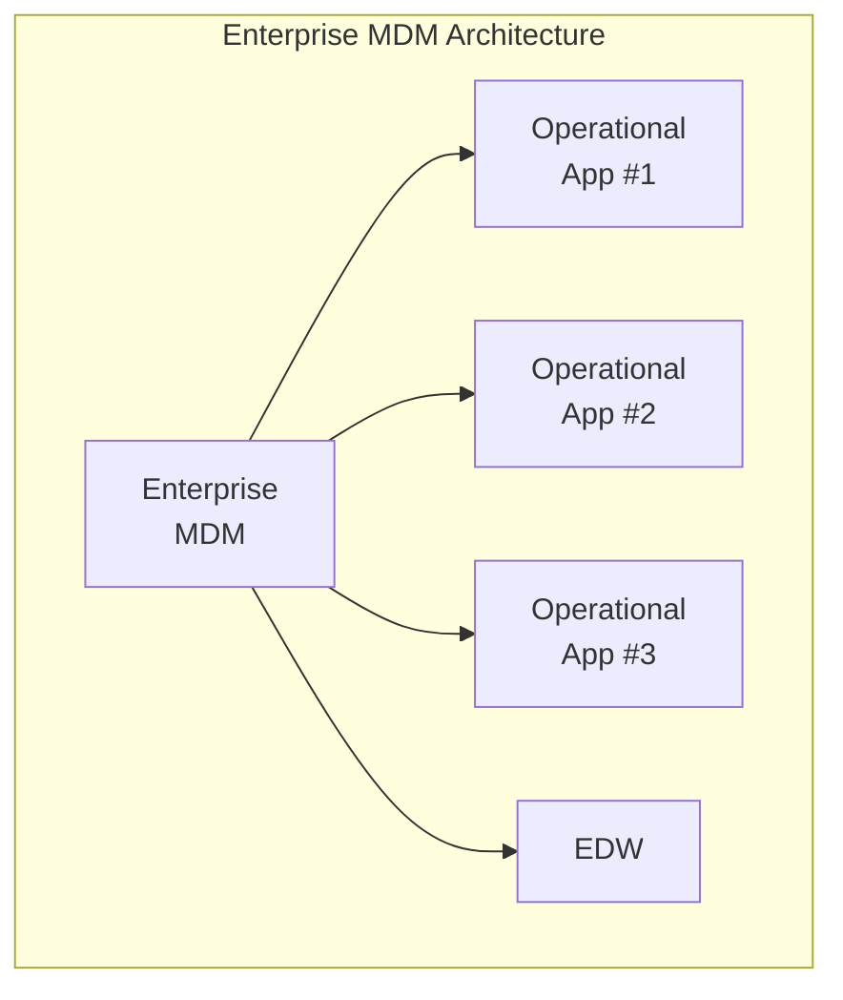
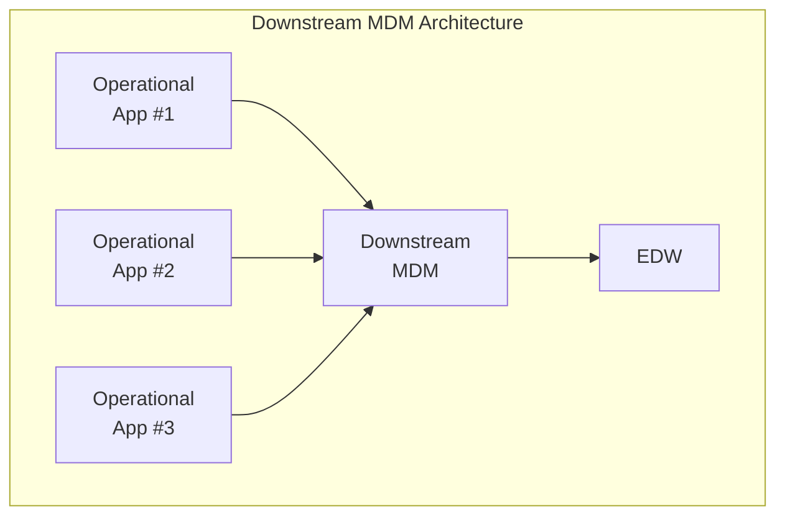

In some cases, you can build a single customer dimension that is the “best of breed” choice among a number of available customer data sources. It is likely that such a conformed customer dimension is a distillation of data from several operational systems within your organization. But it would be typical for a unique customer to have multiple identifiers in multiple touch point systems. To make matters worse, data entry systems often don’t incorporate adequate validation rules. Obviously, an operational CRM objective is to create a unique customer identifier and restrict the creation of unnecessary identifi ers. In the meantime, the DW/BI team will likely be responsible for sorting out and integrating the disparate sources of customer information.

Some organizations are lucky enough to have a centralized **master data management** (MDM) system that takes responsibility for creating and controlling the single enterprise-wide customer entity. But such centralization is rare in the real world. More frequently, the data warehouse extracts multiple incompatible customer data files and builds a “**downstream**” MDM system..

## References

- [[Book - The Data Warehouse Toolkit]] - Chapter 8
