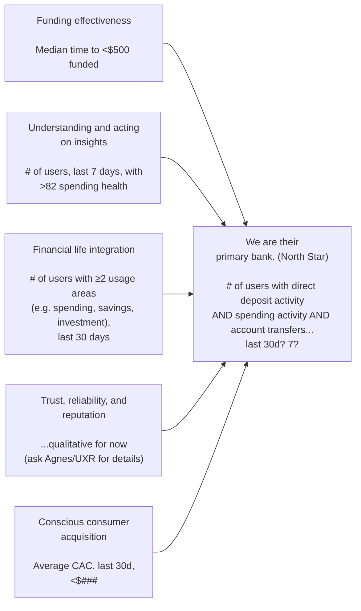

[North Star Framework - Amplitude](https://amplitude.com/blog/product-north-star-metric)

The [North Star Framework](https://amplitude.com/resources/north-star-playbook) is a product management model based on a single metric—your North Star Metric—that best captures the value customers derive from your product. The North Star approach is an incredibly powerful [product strategy framework](https://amplitude.com/blog/product-strategy-template), but when misunderstood or misused, can lead teams astray. This makes getting it right critical.

Your North Star Metric should be the key measure of success for your company's product team. It defines the relationship between the [customer problems](https://amplitude.com/explore/growth/customer-pain-points) your product team is trying to solve and the revenue you aim to generate by doing so.

A good North Star Metric consists of two parts:

- A statement of your product vision
- A metric that serves as a key measure of your current product strategy

A good North Star Metric also aligns to [customer value](https://amplitude.com/blog/shaun-clowes-of-metromile-on-delivering-real-value-to-users), represents your product strategy, and is a leading indicator of success.

The North Star Metric you define should spring from a deep understanding of the actions within your product that provide [**realized value to your customer**](https://amplitude.com/blog/get-customers-to-value-faster). Get as close to impact as possible.

In the product world, this is often referred to as finding your customer’s "[aha moment](https://amplitude.com/aha).” If you can pinpoint the early actions that lead to your customers sticking around, you have an effective North Star Metric.

This means that “[Daily Active Users](https://amplitude.com/glossary/terms/daily-active-users-dau)” or “Registered Users” don't make good North Star Metrics. Though anecdotally useful, they say nothing about what your customers value about your product. When teams fail to connect [customer value](https://amplitude.com/blog/get-customers-to-value-faster) directly to their North Star Metric, they risk leading their business down the wrong path.

A critical aspect of a good North Star Metric is that it's a leading indicator of future success. [Lagging indicators](https://amplitude.com/blog/leading-lagging-indicators) like monthly revenue or [average revenue per user (ARPU)](https://amplitude.com/explore/metrics/what-arpu-how-calculate) don’t give you an early signal of product impact. They tell you what happened in the past rather than predicting future revenue. The further upstream of revenue and market capitalization you can get your metric, the more future impact you can drive.

In most cases, the answer to this question is "yes." It’s unlikely that one product leader should manage more than one North Star. Certainly, larger enterprises with multiple or diverse divisions, product management and development departments, and customer bases could have different North Star Metrics, each with its own inputs.

But if a team contributes to a single profit and loss (P&L) statement with a single product development department and a single product or even a product portfolio that serves a single customer base, we recommend having a single North Star with one metric and its inputs per product.

### Games

The first step in choosing the right North Star metric for your product is to figure out what "game" your business is playing. This game is your core customer engagement model.

Based on our research of products and analysis of over one trillion [behavioral data](https://amplitude.com/blog/behavioral-analytics-definition) points every month, Amplitude has categorized digital products into one of three possible games.

**1. The Attention Game:** How much time are your customers willing to spend in your product?

**2. The Transaction Game:** How many transactions does your user make on your platform?

**3. The Productivity Game:** How efficiently and effectively can someone get their work done in your product?

When we share this framework with product managers, their first reaction is often, “All three games are super important to me.” However, your product team needs to decide on the game your business is playing so they can focus on winning it. Focusing on one game is critical to defining a solid product strategy and North Star Metric.

Below are some examples of companies playing each of these three games and what their product North Star Metrics could be. You will notice that companies playing the same game can have radically different North Stars because it reflects their unique product strategy.

Similarly, Amazon Retail and Walmart might have very different North Stars despite being players in the same transaction game. Amazon's subscription model gives them loyalty and visibility into [customer lifetime value](https://amplitude.com/blog/customer-lifetime-value). So, they're likely optimizing for the number of Prime subscribers and the value they generate. Walmart, on the other hand, is a cost leader and likely focuses on the wallet share of their customer for every visit.

Salesforce aims to be the central source of truth for customer records in B2B companies and using AI to improve sales decision making is a strategic focus. Their North Star might be less focused on user adoption and more focused on the amount of customer data they store for their accounts. Unlike that model, the Adobe Creative Cloud likely focuses on individual subscribers and driving enough engagement to ensure continued subscription.

As you consider what makes a good North Star, also recognize what the North Star
Framework is not. Though it can work alongside and inform many of these models and
concepts, your North Star Framework is not:

- Your roadmap
- Your software development process
- A prioritization framework
- A goal-setting framework, like objectives and key results (OKRs) — although the North
- Star can be a strong foundation upon which to base goals
- Management by objectives (MBOs)
- A one-time quick fix

The North Star Framework works especially well in companies that use a product-led growth (PLG) model. Product-led growth has become a hot topic— especially for B2B SaaS companies—since “growth at any cost” is out and “sustainable growth” is in. PLG is a growth motion that leverages the product, rather than marketing or sales, to drive acquisition, retention, and monetization. A product-led organization optimizes team structures, funding cycles, communication channels, and other processes to ensure the success of its products. To be clear: Calling an organization “product led” doesn’t mean it’s led by a department or job title with the word product in it. Product-led means being guided by the potential of products and product teams.

### North Star Inputs

**Inputs** are a handful influential, complementary factors that you believe most directly affect your North Star Metric and that your team can directly influence through your product. They are as important to the North Star Framework as your metric.

Though a good North Star Metric (NSM) correlates to a top-level business outcome, it can be difficult for a team to move it directly given the multitude of inputs and time it takes to see results. For these reasons, product teams are better served trying to move one component of a NSM that ladders up to the larger metric but is more of a leading indicator of impact.

One heuristic we've found helpful when teams are determining inputs is considering **breadth, depth, frequency, and efficiency**. The inputs to a North Star Metric often follow this pattern, which you can easily adapt to different contexts. Using this framework, every team knows what their inputs are and how they contribute to the North Star. This enables everyone to make the right trade-offs and resourcing decisions.

Below is an example of a North Star tree for a grocery ordering and delivery app. The tree ties together a dozen different product initiatives together into a single framework to drive each dimension of the North Star Metric forward.

If your inputs are too broad or lagging, you might struggle to focus your efforts and measure
impact. On the other hand, if they’re too specific and prescriptive, you might struggle to identify
innovative solutions to address them. For example, an input like “satisfied customers” may be too broad but an input like “positive reviews on social media” may be too narrow.

**Input test 1: the Greenfield test**
For this test, forget about current roadmaps, missions, or other restrictions. Instead, focus on
generating new ideas. Pose this question to the team: *“How many opportunities can you come up with in two minutes to influence this input?”* You can use this format:

*We have an {**opportunity**} to improve {**input**} if we could {some change in behavior / outcome}. Potential **interventions** we might try to exploit that opportunity include {features, experiments, etc.}.*

If your team quickly runs out of ideas, then you might need higher level inputs. If they’re swimming in ideas—many of which are overly broad—then you should get more specific.

**Input test 2: the roadmap check**
For this test, do consider your current roadmap or work in progress. Make a list of current initiatives and discuss how they could influence the inputs you’ve chosen. In many cases, you’ll see a clear link. Sometimes, the link is implicit and contains a host of assumptions worth chatting about. Have these discussions. In some cases, you can’t see the link between the roadmap item and the input. This is a good sign that your set of inputs is missing some factor of your North Star—or that you’re working on something that isn’t actually valuable.

Once you have your inputs defined at a high level, it’ll be much easier to define exact
metrics for each Input.

# Levels of bets model

A bet is something you’re going to do, and each bet might take a different amount of time and have a different level of risk. For instance, a smaller bet might be achieved in a few weeks and is an easy safe project, and a larger bet might take more than a year and could be resource heavy and risky. Bets can also be related, where you might achieve a series of smaller bets to accomplish a larger bet.

Teams can categorize bets into levels, and associate a specific time frame for feedback, execution, or review. Each level is related—you knock out the smaller bets to get the larger bets. Those larger bets—Level 0 and 1—are closely associated with your North Star Metric and inputs.

Here’s a visual understanding of these levels of bets, with an example:

|Bet levels|Time Horizon*|Relationship|Burger King Example|
|---|---|---|---|
|**Level 0**|Years|Connect the North Star Metric to the success of the company and product.|If we increase digital transactions, our total annual sales will increase.|
|**Level 1**|1 to 3 quarters|Connect inputs to the North Star Metric.|If we improve the rate at which new users register for our digital applications, we will increase total digital transactions.|
|**Level 2**|1 to 3 months|These are opportunities to influence an input.|If we make it really appealing for new users to sign up for our mobile product, we’ll increase digital registrations.|
|**Level 3**|1 to 3 weeks|These are interventions to influence opportunities and are what you might accomplish in a sprint.|If we add a feature where the app includes special mobile-only discounts, it will be more appealing for users to register.|

*Time horizons can vary depending on your company. For instance, your level three might only take a few hours or a few days.

Many companies get in the habit of labeling a project as “done” and calling it a day instead of learning from it. To help encourage learning, it’s important to incorporate reviews and helpful to shift the language. Instead of “to do, doing, done,” shift to “focus on next, focusing, and review” and “to try, trying, review.”