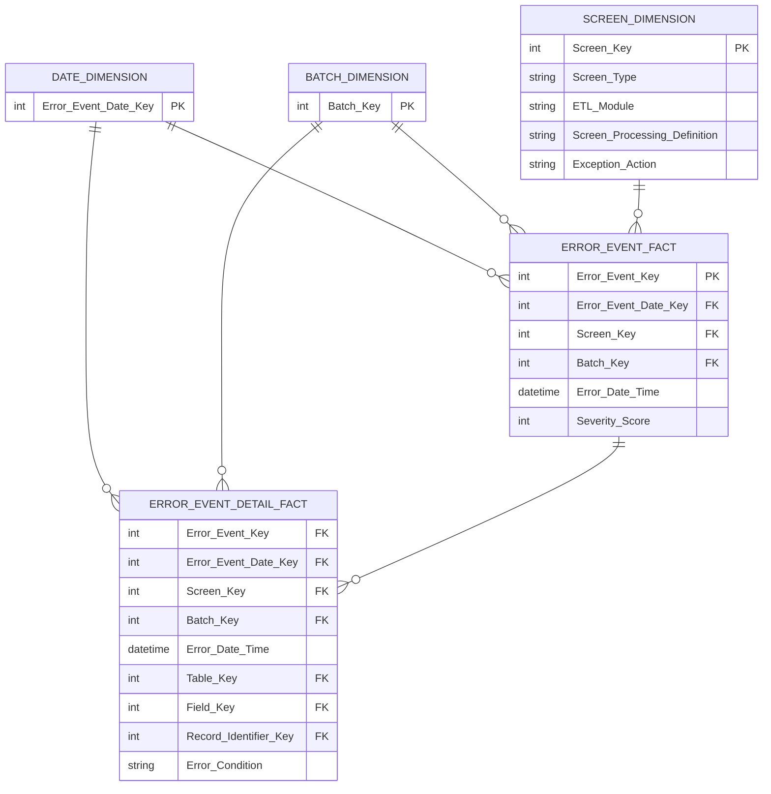
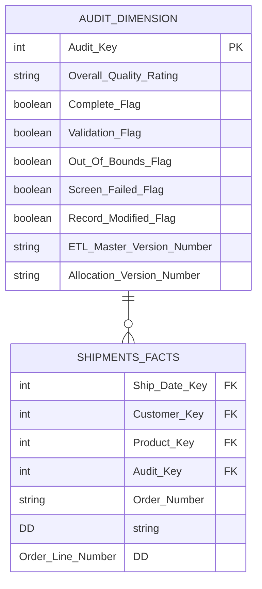
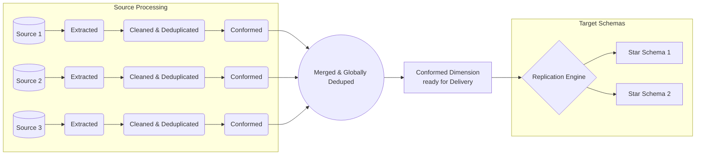

The heart of the ETL architecture is a set of quality screens that act as diagnostic filters in the data flow pipelines. Each quality screen is a test. If the test against the data is successful, nothing happens and the screen has no side effects. But if the test fails, then it must drop an error event row into the error event schema and choose to either halt the process, send the off ending data into suspension, or merely tag the data.

Although all quality screens are architecturally similar, it is convenient to divide them into three types, in ascending order of scope. Jack Olson, in his seminal book Data Quality: The Accuracy Dimension (Morgan Kaufmann, 2002), classified data quality screens into three categories: column screens, structure screens, and business rule screens.

**Column screens** test the data within a single column. These are usually simple, somewhat obvious tests, such as testing whether a column contains unexpected null values, if a value falls outside of a prescribed range, or if a value fails to adhere to a required format.

**Structure screens** test the relationship of data across columns. Two or more attributes may be tested to verify they implement a hierarchy, such as a series of many-to-one relationships. Structure screens also test foreign key/primary key relationships between columns in two tables, and also include testing whole blocks of columns to verify they implement valid postal addresses.

**Business rule screens** implement more complex tests that do not fi t the simpler column or structure screen categories. For example, a customer profile may be tested for a complex time-dependent business rule, such as requiring a lifetime platinum frequent flyer to have been a member for at least five years and have fl own more than 2 million miles. Business rule screens also include aggregate threshold data quality checks, such as checking to see if a statistically improbable number of MRI examinations have been ordered for minor diagnoses like a sprained elbow. In this case, the screen throws an error only after a threshold of such MRI exams is reached.

Each quality screen has to decide what happens when an error is thrown. The choices are:
1) halting the process;
2) sending the off ending record(s) to a suspense file for later processing; and
3) merely tagging the data and passing it through to the next step in the pipeline.

The **third choice** is by far the **best choice**, whenever possible. Halting the process is obviously a pain because it requires manual intervention to diagnose the problem, restart or resume the job, or abort completely. Sending records to a suspense file is often a poor solution because it is not clear when or if these records will be fixed and re-introduced to the pipeline. Until the records are restored to the data flow, the overall integrity of the database is questionable because records are missing. We recommend not using the suspense file for minor data transgressions.
The third option of tagging the data with the error condition often works well. Bad fact table data can be tagged with the audit dimension, as described in subsystem 6. Bad dimension data can also be tagged using an audit dimension, or in the case of missing or garbage data can be tagged with unique error values in the attribute itself.

## Error Event Schema

The error event schema is a centralized dimensional schema whose purpose is to record every error event thrown by a quality screen anywhere in the ETL pipeline. The main table is the error event fact table. Its grain is every error thrown (produced) by a quality screen anywhere in the ETL system. Thus every quality screen error produces exactly one row in this table, and every row in the table corresponds to an observed error.

The dimensions of the error event fact table include the calendar date of the error, the batch job in which the error occurred, and the screen that produced the error. The **calendar date** is not a minute and second time stamp of the error, but rather provides a way to constrain and summarize error events by the usual attributes of the calendar, such as weekday or last day of a fiscal period. The **error date/time** fact is a full relational date/time stamp that specifies precisely when the error occurred. This format is useful for calculating the time interval between error events because you can take the difference between two date/time stamps to get the number of seconds separating events.

The **batch dimension** can be generalized to be a processing step in cases in which data is streamed, rather than batched. The **screen dimension** identifies precisely what the screen criterion is and where the code for the screen resides. It also defines what to do when the screen throws an error. (For example, halt the process, send the record to a suspense fi le, or tag the data.)

The **error event fact table** also has a single column primary key, shown as the error event key. This surrogate key, like dimension table primary keys, is a simple integer assigned sequentially as rows are added to the fact table. This key column is necessary in those situations in which an enormous burst of error rows is added to the error event fact table all at once. Hopefully this won’t happen to you.

The error event schema includes a **second error event detail fact table** at a lower grain. Each row in this table identifies an individual field in a specific record that participated in an error. Thus a complex structure or business rule error that triggers a single error event row in the higher level error event fact table may generate many rows in this error event detail fact table. The two tables are tied together by the error event key, which is a foreign key in this lower grain table. The error event detail table identifies the table, record, field, and precise error condition. Thus a complete
description of complex multi-field, multi-record errors is preserved by these tables.

The error event detail table could also contain a precise date/time stamp to provide a full description of aggregate threshold error events where many records generate an error condition over a period of time. You should now appreciate that each quality screen has the responsibility for populating these tables at the time of an error.

## Audit Dimension

The audit dimension is a special dimension that is assembled in the back room by the ETL system for each fact table. The audit dimension contains the metadata context at the moment when a specific fact table row is created. To visualize how audit dimension rows are created, imagine this shipments fact table is updated once per day from a batch file. Suppose today you have a perfect run with no errors flagged. In this case, you would generate only one audit dimension row, and it would be attached to every fact row loaded today. All the categories, scores, and version numbers would be the same.

## Deduplication

Often dimensions are derived from several sources. This is a common situation for organizations that have many customer-facing source systems that create and manage separate customer master tables. Customer information may need to be merged from several lines of business and outside sources. Sometimes, the data can be matched through identical values in some key column. However, even when a definitive match occurs, other columns in the data might contradict one another, requiring a decision on which data should survive.

Survivorship is the process of combining a set of matched records into a unified image that combines the highest quality columns from the matched records into a conformed row. Survivorship involves establishing clear business rules that define the priority sequence for column values from all possible source systems to enable the creation of a single row with the best-survived attributes. If the dimensional design is fed from multiple systems, you must maintain separate columns with back references, such as natural keys, to all participating source systems used to construct the row.

There are a variety of data integration and data standardization tools to consider if you have difficult deduplicating, matching, and survivorship data issues. These tools are quite mature and in widespread use.

## Conforming Dimensions

**Conforming** consists of all the steps required to align the content of some or all the columns in a dimension with columns in similar or identical dimensions in other parts of the data warehouse. For instance, in a large organization you may have fact tables capturing invoices and customer service calls that both utilize the customer dimension. It is highly likely the source systems for invoices and customer service have separate customer databases. It is likely there will be little guaranteed consistency between the two sources of customer information. The data from these two customer sources needs to be conformed to make some or all the columns describing customer share the same domains.

