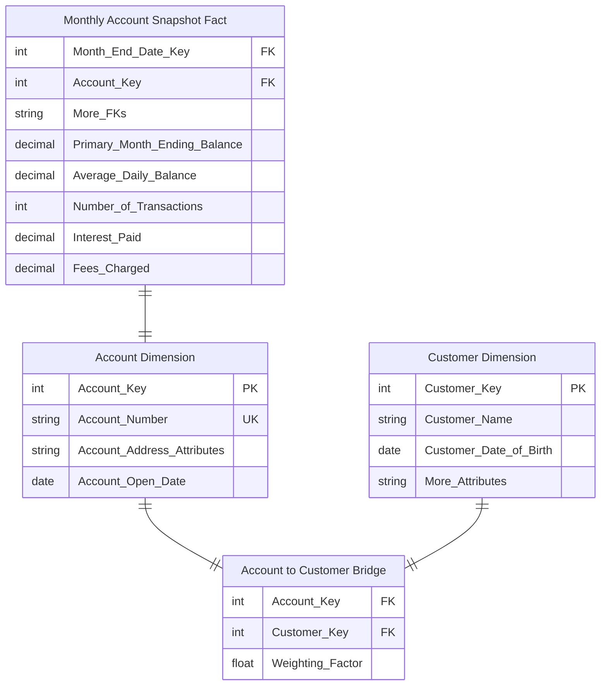
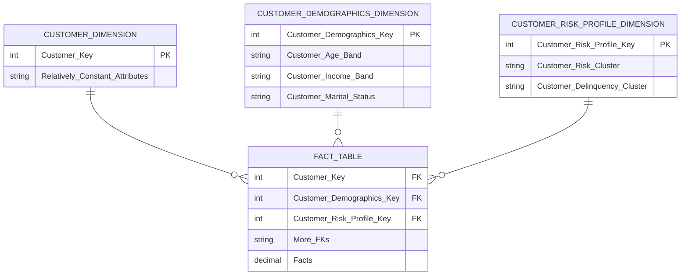

[[Dimensional Modeling]]
[[Book - The Data Warehouse Toolkit]]

If a piece of descriptive information has exactly **one** value for each fact/measurement, it can probably be stored in an existing or a new dimension.
## Conformed Dimensions

The essential requirement for two dimensions to be conformed is they share one or more specially administered attributes that have the same **column** **names** and **data values**. 

### Partial Conformity of Multiple Customer Dimensions

Enterprises today build customer knowledge stores that collect all the internal and external customer-facing data sources they can find. A large organization could have as many as 20 internal data sources and 50 or more external data sources, all of which relate in some way to the customer. These sources can vary wildly in granularity and consistency. Of course, there is no guaranteed high-quality customer key defined across all these data sources and no consistent attributes. You don’t have any control over these sources. It seems like a hopeless mess.

Instead of requiring dozens of customer-related dimensions to be identical, you only require they share the specially administered conformed attributes. Not only have you taken the pressure off the data warehouse by relaxing the requirement that all the customer dimensions in your environment be equal from top to bottom, but in addition you can proceed in an incremental and agile way to plant the specially administered conformed attributes in each of the customer-related dimensions.

For example, suppose you start by defining a fairly high-level categorization of customers. You can proceed methodically across all the customer-related dimensions, planting this attribute in each dimension without changing the grain of any target dimension and without invalidating any existing applications that depend on those dimensions. Over a period of time, you gradually increase the scope of integration as you add the special attributes to the separate customer dimensions attached to different sources. At any point in time, you can stop and perform drill-across reports using the dimensions where you have inserted the customer category attribute.

## Dimension Change Reason Tracking

[Kimball Group - Design Tip 80](https://www.kimballgroup.com/2006/06/design-tip-80-adding-a-row-change-reason-attribute/)

When a dimension row contains type 2 attributes, you can embellish it with a **change reason**. In this way, some ETL-centric metadata is embedded with the actual data. The change reason attribute could contain a two-character abbreviation for each changed attribute on a dimension row. For example, the change reason attribute value for a last name change could be LN or a more legible value, such as Last Name, depending on the intended usage and audience. If someone asks how many people changed ZIP codes last year, the SELECT statement would include a LIKE operator and wild cards, such as "WHERE ChangeReason LIKE '%ZIP%’".

Because multiple dimension attributes may change concurrently and be represented by a single new row in the dimension, the change reason would be multi-valued. As we’ll explore later in the chapter when discussing employee skills, the multiple reason codes could be handled as a single text string attribute, such as “|Last Name|ZIP|” or via a multivalued bridge table.

## Type 2 Attributes or Fact Events

Tracking changes within the employee dimension table enables you to easily associate the employee’s accurate profile with multiple business processes. You simply load these fact tables with the employee key in effect when the fact event occurred, and filter and group based on the full spectrum of employee attributes.

But the pendulum can swing too far. You probably shouldn’t use the employee dimension to track every employee review event, every benefit participation event, or every professional development event. Many of these events involve other dimensions, like an event date, organization, benefit description, reviewer, approver, exit interviewer, separation reasons, and the list goes on. Consequently, most of them should be handled as separate process-centric fact tables. Although many human resources events are **factless**, capturing them within a fact table enables business users to easily count or trend by time periods and all the other associated dimensions.

## Multivalued Dimensions and Weighting Factors

An account can have one, two, or more individual account holders, or customers, associated with it. Obviously, the customer cannot be included as an account attribute (beyond the designation of a primary customer/account holder); doing so violates the granularity of the dimension table because more than one individual can be associated with an account. Likewise, you cannot include a customer as an additional dimension in the fact table; doing so violates the granularity of the fact table (one row per account per month), again because more than one individual can be associated with any given account. This is another classic example of a multivalued dimension. To link an individual customer dimension to an account-grained fact table requires the use of an account-to-customer bridge table.

If an account has two account holders, then the associated bridge table has two rows. You assign a numerical **weighting factor** to each account holder such that the sum of all the weighting factors is exactly 1.00. The weighting factors are used to allocate any of the numeric additive facts across individual account holders. In this way you can add up all numeric facts by individual holder, and the grand total will be the correct grand total amount. This kind of report is a **correctly weighted report**.

## Mini-Dimensions

There are a wide variety of attributes describing the bank’s accounts, customers, and households, including monthly credit bureau attributes, external demographic data, and calculated scores to identify their behavior, retention, profitability, and delinquency characteristics. Financial services organizations are typically interested in understanding and responding to changes in these attributes over time.

As discussed earlier, it’s unreasonable to rely on slowly changing dimension technique type 2 to track changes in the account dimension given the dimension row count and attribute volatility, such as the monthly update of credit bureau attributes. Instead, you can break off the browseable and changeable attributes into multiple mini-dimensions, such as credit bureau and demographics mini-dimensions, whose keys are included in the fact table.

Account-oriented fi nancial services are a good environment for using mini-dimensions because the primary fact table is a very long-running periodic snapshot. Thus every month a fact table row is guaranteed to exist for every account, providing a home for all the associated foreign keys.

One of the compromises associated with mini-dimensions is the need to band attribute values to maintain reasonable mini-dimension row counts. Rather than storing extremely discrete income amounts, such as $31,257.98, you store income ranges, such as $30,000 to $34,999 in the mini-dimension.

Most organizations find these banded attribute values support their routine analytic requirements, however there are two situations in which banded values may be inadequate. First, **data mining analysis** often requires discrete values rather than fixed bands to be effective. Secondly, a limited number of **power analysts** may want to analyze the discrete values to determine if the bands are appropriate. In this case, you still maintain the **banded value mini-dimension attributes** to support consistent day-to-day analytic reporting but also store the key discrete numeric values as **facts in the fact table**. Finally, if needed, the current profitability range or score could be included in the account dimension where any changes are handled by deliberately overwriting the **type 1 attribute**. 

## Supertypes and Subtypes Dimensions

Business users typically require two different perspectives that are difficult to present in a single fact table. The first perspective is the **global view**, including the ability to slice and dice all accounts simultaneously, regardless of their product type. This global view is needed to plan appropriate customer relationship management cross-sell and up-sell strategies against the aggregate customer/household base spanning all possible products. In this situation, you need the single **supertype fact table** that crosses all the lines of business to provide insight into the complete account portfolio. Note, however, that the supertype fact table can present only a **limited number of facts** that make sense for virtually every line of business. You cannot accommodate incompatible facts in the supertype fact table because there may be several hundred of these facts when all the possible account types are considered. Similarly, the supertype product dimension must be restricted to the **subset of common product attributes**.

The second perspective is the **line-of-business view** that focuses on the in-depth details of one business, such as checking. There is a long list of special facts and attributes that make sense only for the checking business. These special facts cannot be included in the supertype fact table; if you did this for each line of business in a retail bank, you would end up with hundreds of special facts, most of which would have null values in any specific row. Likewise, if you attempt to include line-of-business attributes in the account or product dimension tables, these tables would have hundreds of special attributes, almost all of which would be empty for any given row. The resulting tables would resemble Swiss cheese, littered with data holes. The solution to this dilemma for the checking department in this example is to create a **subtype schema** for the checking line of business that is limited to just checking accounts.

The keys of the **subtype** account dimensions are the same keys used in the **supertype** account dimension, which contains all possible account keys. For example, if the bank offers a “$500 minimum balance with no per check charge” checking account, this account would be identified by the same surrogate key in both the supertype and subtype checking account dimensions. **Each subtype account dimension is a shrunken conformed dimension with a subset of rows from the supertype account dimension table; each subtype account dimension contains attributes specific to a particular account type.**

This supertype/subtype design technique applies to any business that offers **widely varied products through multiple lines of business**. If you work for a technology company that sells hardware, software, and services, you can imagine building supertype sales fact and product dimension tables to deliver the global customer perspective. The supertype tables would include all facts and dimension attributes that are common across lines of business. The supertype tables would then be supplemented with schemas that do a deep dive into subtype facts and attributes that vary by business. 

### Shrunken and rollup dimensions

Shrunken dimensions are conformed dimensions that are a _subset_ of rows and /or columns of a base dimension. _Shrunken rollup_ dimensions are required when constructing aggregate fact tables. They are also necessary for business processes that naturally capture data at a higher level of granularity, such as a forecast by month and brand (instead of the more atomic date and product associated with sales data). Another case of conformed dimension subsetting occurs when two dimensions are at the same level of detail, but one represents only a subset of rows.

## Hot Swappable Dimensions

A brokerage house may have **many clients** who track the stock market. All of them access the same fact table of daily high-low-close stock prices. But each client has a confidential set of attributes describing each stock. The brokerage house can support this multi-client situation by having a separate copy of the stock dimension for each client, which is joined to the single fact table at query time. We call these hot swappable dimensions.

## Combining Correlated Dimensions

Typically, **many-to-many** relationship exists between two groups of dimension attributes should be modeled as separate dimensions with separate foreign keys in the fact table. Sometimes, however, you encounter situations where these dimensions can be combined into a **single dimension** rather than treating them as two separate dimensions with two separate foreign keys in the fact table.

Following a design checkpoint with the business community, you learn the users also want to analyze the booking class purchased. In addition, the business users want to easily filter and report on activity based on whether an upgrade or downgrade occurred.

Your initial reaction might be to include a second role-playing dimension and foreign key in the fact table to support both the purchased and flown class of service. In addition, you would need a third foreign key for the upgrade indicator; otherwise, the BI application would need to include logic to identify numerous scenarios as upgrades, including economy to premium economy, economy to business, economy to first, premium economy to business, and so on.

In this situation, however, there are only four rows in the class dimension table to indicate first, business, premium economy, and economy classes. Likewise, the upgrade indicator dimension also would have just three rows in it, corresponding to upgrade, downgrade, or no class change. Because the row counts are so small, you can elect instead to combine the dimensions into a single class of service dimension,

| Indicator | Class of Service | Class Purchased | Class Flown  | Purchased-Flown Group     | Class Change    |
| --------: | ---------------- | --------------- | ------------ | ------------------------- | --------------- |
|         1 | Economy          | Economy         | Economy      | Economy-Economy           | No Class Change |
|         2 | Economy          | Economy         | Prem Economy | Economy-Prem Economy      | Upgrade         |
|         3 | Economy          | Economy         | Business     | Economy-Business          | Upgrade         |
|         4 | Economy          | Economy         | First        | Economy-First             | Upgrade         |
|         5 | Prem Economy     | Prem Economy    | Economy      | Prem Economy-Economy      | Downgrade       |
|         6 | Prem Economy     | Prem Economy    | Prem Economy | Prem Economy-Prem Economy | No Class Change |
|         7 | Prem Economy     | Prem Economy    | Business     | Prem Economy-Business     | Upgrade         |
|         8 | Prem Economy     | Prem Economy    | First        | Prem Economy-First        | Upgrade         |
|         9 | Business         | Business        | Economy      | Business-Economy          | Downgrade       |
|        10 | Business         | Business        | Prem Economy | Business-Prem Economy     | Downgrade       |
|        11 | Business         | Business        | Business     | Business-Business         | No Class Change |
|        12 | Business         | Business        | First        | Business-First            | Upgrade         |
|        13 | First            | First           | Economy      | First-Economy             | Downgrade       |
|        14 | First            | First           | Prem Economy | First-Prem Economy        | Downgrade       |
|        15 | First            | First           | Business     | First-Business            | Downgrade       |
|        16 | First            | First           | First        | First-First               | No Class Change |

Note that this pattern is similar to **junk dimensions**