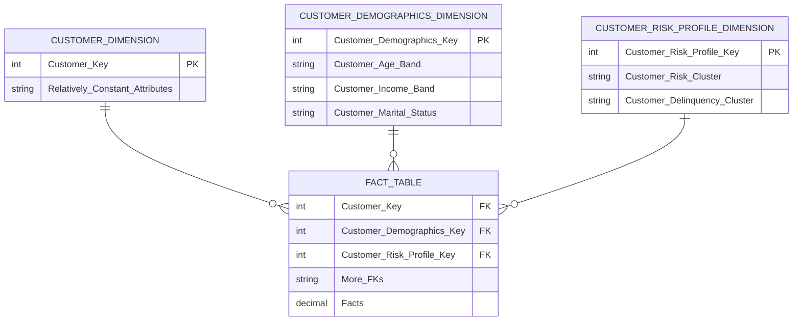
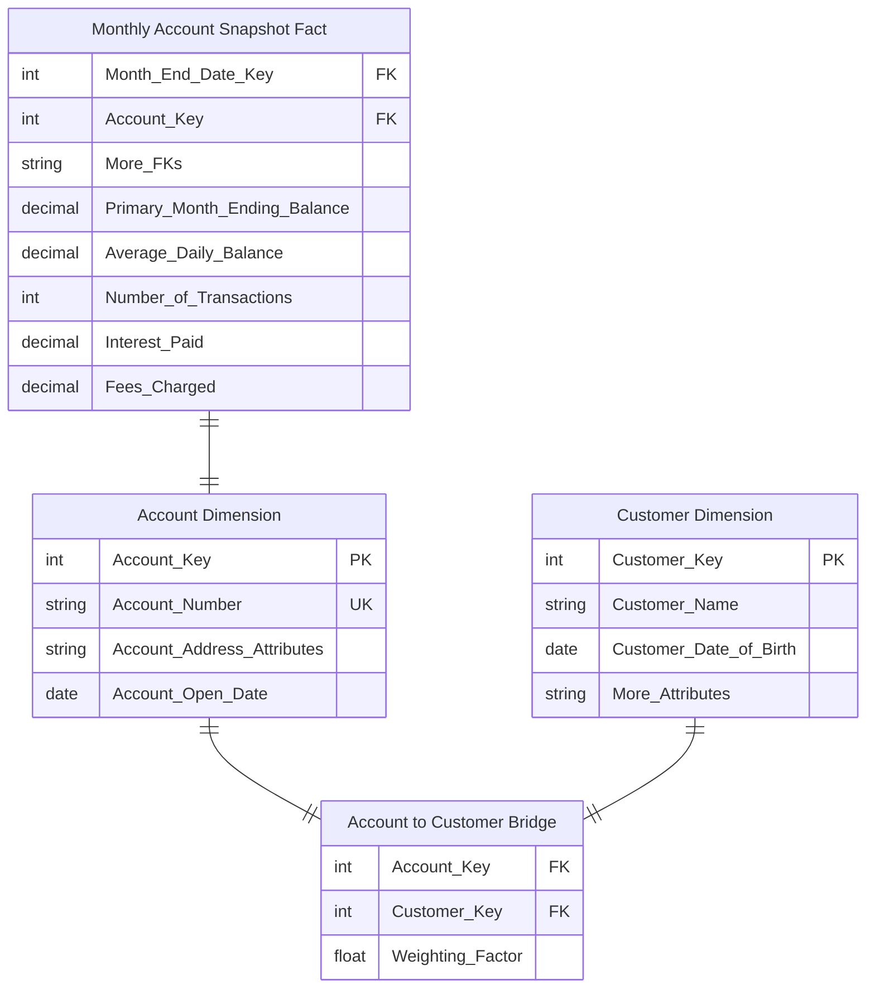
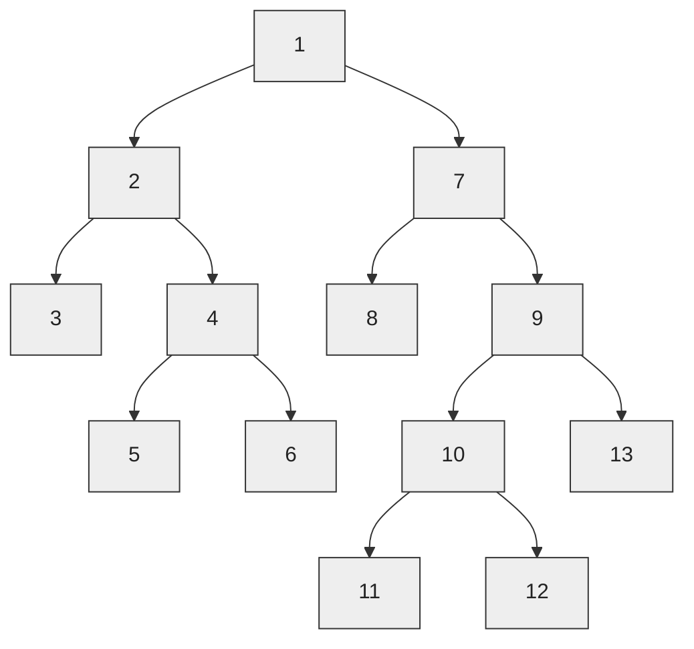
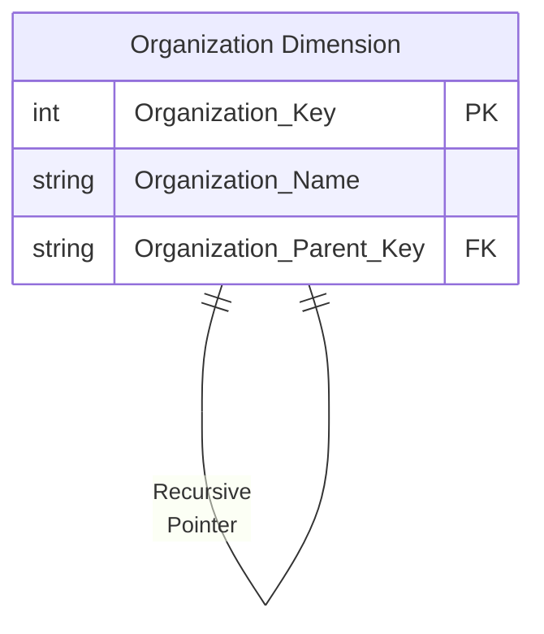
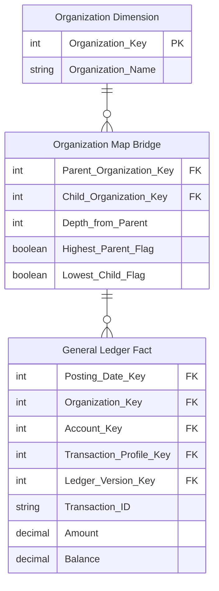

[[Dimensional Modeling]]
[[Book - The Data Warehouse Toolkit]]

If a piece of descriptive information has exactly **one** value for each fact/measurement, it can probably be stored in an existing or a new dimension. Every dimension table has a single primary key column. This primary key is embedded as a foreign key in any associated fact table where the dimension row’s descriptive context is exactly correct for that fact table row. Dimension tables are usually wide, flat denormalized tables with many low-cardinality text attributes. While operational codes and indicators can be treated as attributes, the most powerful dimension attributes are populated with verbose descriptions. Dimension table attributes are the primary target of constraints and grouping specifications from queries and BI applications. The descriptive labels on reports are typically dimension attribute domain values.

## Dimensions Surrogate Keys

A dimension table is designed with one column serving as a unique primary key. This primary key cannot be the operational system’s natural key because there will be multiple dimension rows for that natural key when changes are tracked over time. In addition, natural keys for a dimension may be created by more than one source system, and these natural keys may be incompatible or poorly administered. The DW/BI system needs to claim control of the primary keys of all dimensions; rather than using explicit natural keys or natural keys with appended dates, you should create anonymous integer primary keys for every dimension. These dimension surrogate keys are simple integers, assigned in sequence, starting with the value 1, every time a new key is needed. The date dimension is exempt from the surrogate key rule; this highly predictable and stable dimension can use a more meaningful primary key.

### Natural, Durable and Supernatural Keys

Natural keys created by operational source systems are subject to business rules outside the control of the DW/BI system. For instance, an employee number (natural key) may be changed if the employee resigns and then is rehired. When the data warehouse wants to have a single key for that employee, a new durable key must be created that is persistent and does not change in this situation. This key is sometimes referred to as a durable supernatural key. The best durable keys have a format that is independent of the original business process and thus should be simple integers assigned in sequence beginning with 1. While multiple surrogate keys may be associated with an employee over time as their profile changes, the durable key never changes.


## Junk Dimensions
Transactional business processes typically produce a number of miscellaneous, low-cardinality flags and indicators. Rather than making separate dimensions for each flag and attribute, you can create a single **junk dimension** combining them together. This dimension, frequently labeled as a transaction profile dimension in a schema, does not need to be the Cartesian product of all the attributes’ possible values, but should only contain the combination of values that actually occur in the source data.

Junk dimensions are made up from text and miscellaneous flags left over in the fact table after you remove all the critical attributes. There are two approaches for creating junk dimensions in the ETL system. If the theoretical number of rows in the dimension is fixed and known, the junk dimension can be created in advance. In other cases, it may be necessary to create newly observed junk dimension rows on-the-fly while processing fact row input. This process requires assembling the junk dimension attributes and comparing them to the existing junk dimension rows to see if the row already exists. If not, a new dimension row must be assembled, a surrogate key created, and the row loaded into the junk dimension on-the-fly during the fact table load process.

Mini-dimensions are a technique used to track dimension attribute changes in a large dimension when the type 2 technique is infeasible, such as a customer dimension. From an ETL perspective, creation of the mini-dimension is similar to the junk dimension process previously described. Again, there are two alternatives: building all valid combinations in advance or recognizing and creating new combinations on-the-fly. Although **junk dimensions** are usually built from the fact table input, **mini-dimensions** are built from dimension table inputs. The ETL system is responsible for maintaining a multicolumn surrogate key lookup table to identify the base dimension member and appropriate mini-dimension row to support the surrogate pipeline process.

## Snowflaked and Outrigger Dimensions

When a hierarchical relationship in a dimension table is normalized, low-cardinality attributes appear as secondary tables connected to the base dimension table by an attribute key. When this process is repeated with all the dimension table’s hierarchies, a characteristic multilevel structure is created that is called a **snowflake**. Although the snowflake represents hierarchical data accurately, you should avoid snowflakes because it is difficult for business users to understand and navigate
snowflakes. They can also negatively impact query performance. A flattened denormalized dimension table contains exactly the same information as a snowflaked dimension.

A dimension can contain a reference to another dimension table. For instance, a bank account dimension can reference a separate dimension representing the date the account was opened. These secondary dimension references are called **outrigger dimensions**. Outrigger dimensions are permissible, but should be used sparingly. In most cases, the correlations between dimensions should be demoted to a fact table, where both dimensions are represented as separate foreign keys.
## Conformed Dimensions

Dimension tables **conform** when attributes in separate dimension tables have the **same column names and domain contents**. Information from separate fact tables can be combined in a single report by using conformed dimension attributes that are associated with each fact table. When a conformed attribute is used as the row header (that is, the grouping column in the SQL query), the results from the separate fact tables can be aligned on the same rows in a drill-across report. The essential requirement for two dimensions to be conformed is they share one or more specially administered attributes that have the same **column** **names** and **data values**. 

### Shrunken and rollup dimensions

**Shrunken dimensions** are conformed dimensions that are a _subset_ of rows and / or columns of a base dimension. _Shrunken rollup_ dimensions are required when constructing aggregate fact tables. They are also necessary for business processes that naturally capture data at a higher level of granularity, such as a forecast by month and brand (instead of the more atomic date and product associated with sales data). Another case of conformed dimension subsetting occurs when two dimensions are at the same level of detail, but one represents only a subset of rows.

I recently ran across a good example of the need for a shrunken dimension from a Kimball Group enthusiast who works for a company that manages shopping mall properties. They capture some facts at the store level such as rent payments, and other facts at the overall property level such as shopper traffic and utility costs. Remember, a fundamental design goal is to capture data at the lowest grain possible. In this case, we would first attempt to allocate the property level data down to the store level. However, the company in question felt some of the property data could not be sensibly allocated to the store level; therefore they needed fact tables at **both** the store and property levels. This means they also needed dimensions at the store and property level.

There are many ways to create a shrunken dimension, depending on how the data is structured in the source system. The easiest way is to **create the base dimension first**. In this case, build the **Store dimension** by extracting store and property level natural keys and attributes from the source, assigning surrogate keys and tracking changes to important attributes with Type 2 change tracking.

The Store dimension will have several property level attributes including the property’s natural key because users will want to roll up store facts by property descriptions. They will also ask questions that only involve the relationship between store and property, such as “What is the average number of stores per property?”.

Once the lowest level dimension is in place, creating the initial shrunken dimension, in this case the Property dimension, is essentially the same as creating the mini-dimension we described in Design Tip #127. Identify the attributes you want to extract from the base dimension and create a new table with a surrogate key column. Populate the table using a SELECT DISTINCT of the columns from the base dimension along with an IDENTITY field or SEQUENCE to create the surrogate key. In the property example, the following SQL would get you started:

INSERT INTO Dim_Property  
SELECT DISTINCT Property_Name, Property_Type, Property_SqFt, MIN(Effective_Date), MAX(End_Date)  
FROM Dim_Store  
GROUP BY Property_Name, Property_Type, Property_SqFt;

The incremental processing is a bit more challenging. The easiest approach if you are working from an existing base dimension as we’ve describe is to use the brute force method. Create a temporary shrunken dimension by applying the same SELECT DISTINCT to the newly loaded base dimension. Then process any type 2 changes by comparing the current rows of the temporary shrunken dimension (WHERE End_Date = ‘9999-12-31’) to the current rows of the master shrunken dimension based on the shrunken dimension’s natural key.

Shrunken dimensions are conformed dimensions that are a subset of rows and/ or columns of one of your base dimensions. The ETL data flow should build conformed shrunken dimensions from the base dimension, rather than independently, to assure conformance. **The primary key for the shrunken dimension, however, must be independently generated**; if you attempt to use a key from an “example” base dimension row, you will get into trouble if this key is retired or superseded.
### Partial Conformity of Multiple Customer Dimensions

Enterprises today build customer knowledge stores that collect all the internal and external customer-facing data sources they can find. A large organization could have as many as 20 internal data sources and 50 or more external data sources, all of which relate in some way to the customer. These sources can vary wildly in granularity and consistency. Of course, there is no guaranteed high-quality customer key defined across all these data sources and no consistent attributes. You don’t have any control over these sources. It seems like a hopeless mess.

Instead of requiring dozens of customer-related dimensions to be identical, you only require they share the specially administered conformed attributes. Not only have you taken the pressure off the data warehouse by relaxing the requirement that all the customer dimensions in your environment be equal from top to bottom, but in addition you can proceed in an incremental and agile way to plant the specially administered conformed attributes in each of the customer-related dimensions.

For example, suppose you start by defining a fairly high-level categorization of customers. You can proceed methodically across all the customer-related dimensions, planting this attribute in each dimension without changing the grain of any target dimension and without invalidating any existing applications that depend on those dimensions. Over a period of time, you gradually increase the scope of integration as you add the special attributes to the separate customer dimensions attached to different sources. At any point in time, you can stop and perform drill-across reports using the dimensions where you have inserted the customer category attribute.

## Slowly Changing Dimensions

### Type 0 - Durable
With type 0, the dimension attribute value never changes, so facts are always grouped by this original value. Type 0 is appropriate for any attribute labeled “original,” such as a customer’s original credit score or a durable identifier. It also applies to most attributes in a date dimension.
### Type 1 - Overwrite

With type 1, the old attribute value in the dimension row is overwritten with the new value; type 1 attributes always reflects the most recent assignment, and therefore this technique destroys history.
### Type 2 - Add new Row
Type 2 changes add a new row in the dimension with the updated attribute values. This requires generalizing the primary key of the dimension beyond the natural or durable key because there will potentially be multiple rows describing each member. When a new row is created for a dimension member, a new primary surrogate key is assigned and used as a foreign key in all fact tables from the moment of the update until a subsequent change creates a new dimension key and updated dimension row. A minimum of three additional columns should be added to the dimension row with type 2 changes: 1) row effective date or date/time stamp; 2) row expiration
date or date/time stamp; and 3) current row indicator.

It’s important to ensure there are **no gaps** in the series. We prefer to set the row end date for the older version of the dimension member to **the day before** the row effective date for the new row if these row dates have a granularity of a full day. If the effective and end dates are actually **precise**
**date/time stamps** accurate to the minute or second, then the end date/time must be set to **exactly** the begin date/time of the next row so that no gap exists between rows.
### Type 3 - Add new Column
Type 3 changes add a new attribute in the dimension to preserve the old attribute value; the new value overwrites the main attribute as in a type 1 change. This kind of type 3 change is sometimes called an alternate reality. A business user can group and filter fact data by either the current value or alternate reality. This slowly changing dimension technique is used relatively infrequently.
### Type 4 - Mini-Dimension
The type 4 technique is used when a group of attributes in a dimension rapidly changes and is split off to a **mini-dimension**. This situation is sometimes called a rapidly changing monster dimension. Frequently used attributes in multimillion-row dimension tables are mini-dimension design candidates, even if they don’t frequently change. The type 4 mini-dimension requires its own unique primary key; the primary keys of both the base dimension and mini-dimension are captured in the associated fact tables.
#### Mini-Dimension and Type 1 Outrigger
The type 5 technique is used to accurately preserve historical attribute values, plus report historical facts according to current attribute values. Type 5 builds on the type 4 mini-dimension by also embedding a current type 1 reference to the mini-dimension in the base dimension. This enables the currently-assigned mini-dimension attributes to be accessed along with the others in the base dimension without linking through a fact table. Logically, you’d represent the base dimension and mini-dimension outrigger as a single table in the presentation area. The ETL team must overwrite this type 1 mini-dimension reference whenever the current mini-dimension assignment changes.
### Type 1 + Type 2 Hybrids
#### Add Type 1 Attributes to Type 2 Dimension
Type 6 delivers both historical and current dimension attribute values. Type 6 builds on the type 2 technique by also embedding current type 1 versions of the same attributes in the dimension row so that fact rows can be filtered or grouped by either the type 2 attribute value in effect when the measurement occurred or the attribute’s current value. In this case, the type 1 attribute is systematically overwritten on all rows associated with a particular durable key
whenever the attribute is updated.
#### Dual Type 1 and Type 2 Dimensions
Type 7 is the final hybrid technique used to support both as-was and as-is reporting. A fact table can be accessed through a dimension modeled both as a type 1 dimension showing only the most current attribute values, or as a type 2 dimension showing correct contemporary historical profiles. The same dimension table enables both perspectives. Both the durable key and primary surrogate key of the dimension are placed in the fact table. For the type 1 perspective, the current flag in the dimension is constrained to be current, and the fact table is joined via the durable key. For the type 2 perspective, the current fl ag is not constrained, and the fact table is joined via the surrogate primary key. These two perspectives would be deployed as separate views to the BI applications.

## Mini Dimensions

There are a wide variety of attributes describing the bank’s accounts, customers, and households, including monthly credit bureau attributes, external demographic data, and calculated scores to identify their behavior, retention, profitability, and delinquency characteristics. Financial services organizations are typically interested in understanding and responding to changes in these attributes over time.

As discussed earlier, it’s unreasonable to rely on slowly changing dimension technique type 2 to track changes in the account dimension given the dimension row count and attribute volatility, such as the monthly update of credit bureau attributes. Instead, you can break off the browseable and changeable attributes into multiple mini-dimensions, such as credit bureau and demographics mini-dimensions, whose keys are included in the fact table.

Account-oriented financial services are a good environment for using mini-dimensions because the primary fact table is a very long-running periodic snapshot. Thus every month a fact table row is guaranteed to exist for every account, providing a home for all the associated foreign keys.



One of the compromises associated with mini-dimensions is the need to band attribute values to maintain reasonable mini-dimension row counts. Rather than storing extremely discrete income amounts, such as $31,257.98, you store income ranges, such as $30,000 to $34,999 in the mini-dimension.

Most organizations find these banded attribute values support their routine analytic requirements, however there are two situations in which banded values may be inadequate. First, **data mining analysis** often requires discrete values rather than fixed bands to be effective. Secondly, a limited number of **power analysts** may want to analyze the discrete values to determine if the bands are appropriate. In this case, you still maintain the **banded value mini-dimension attributes** to support consistent day-to-day analytic reporting but also store the key discrete numeric values as **facts in the fact table**. Finally, if needed, the current profitability range or score could be included in the account dimension where any changes are handled by deliberately overwriting the **type 1 attribute**. 
## Dimension Management System

The dimension manager is a centralized authority who prepares and publishes conformed dimensions to the data warehouse community. A conformed dimension is by necessity a centrally managed resource: Each conformed dimension must have a single, consistent source. It is the dimension manager’s responsibility to administer and publish the conformed dimension(s) for which he has responsibility. There may be multiple dimension managers in an organization, each responsible for a dimension.
It is easier to manage conformed dimensions in a single tablespace DBMS on a single machine because there is only one copy of the dimension table. However, managing conformed dimensions becomes more difficult in multiple tablespace, multiple DMBS, or multimachine distributed environments. In these situations, the dimension manager must carefully manage the simultaneous release of new versions of the dimension to every fact provider. Each conformed dimension should have a version number column in each row that is overwritten in every row whenever the dimension manager releases the dimension. This version number should be utilized to support any drill-across queries to assure that the same release of the dimension is being utilized. The dimension manager’s responsibilities include the following ETL
processing:
- Implement the common descriptive labels agreed to by the data stewards and stakeholders during the dimension design.
- Add new rows to the conformed dimension for new source data, generating new surrogate keys.
- Add new rows for type 2 changes to existing dimension entries, generating new surrogate keys.
- Modify rows in place for type 1 changes and type 3 changes, without changing the surrogate keys.
- Update the version number of the dimension if any type 1 or type 3 changes are made.
- Replicate the revised dimension simultaneously to all fact table providers.

## Dimension Change Reason Tracking

[Kimball Group - Design Tip 80](https://www.kimballgroup.com/2006/06/design-tip-80-adding-a-row-change-reason-attribute/)

When a dimension row contains type 2 attributes, you can embellish it with a **change reason**. In this way, some ETL-centric metadata is embedded with the actual data. The change reason attribute could contain a two-character abbreviation for each changed attribute on a dimension row. For example, the change reason attribute value for a last name change could be LN or a more legible value, such as Last Name, depending on the intended usage and audience. If someone asks how many people changed ZIP codes last year, the SELECT statement would include a LIKE operator and wild cards, such as "WHERE ChangeReason LIKE '%ZIP%’".

Because multiple dimension attributes may change concurrently and be represented by a single new row in the dimension, the change reason would be multi-valued. As we’ll explore later in the chapter when discussing employee skills, the multiple reason codes could be handled as a single text string attribute, such as “|Last Name|ZIP|” or via a multivalued bridge table.

## Type 2 Attributes or Fact Events

Tracking changes within the employee dimension table enables you to easily associate the employee’s accurate profile with multiple business processes. You simply load these fact tables with the employee key in effect when the fact event occurred, and filter and group based on the full spectrum of employee attributes.

But the pendulum can swing too far. You probably shouldn’t use the employee dimension to track every employee review event, every benefit participation event, or every professional development event. Many of these events involve other dimensions, like an event date, organization, benefit description, reviewer, approver, exit interviewer, separation reasons, and the list goes on. Consequently, most of them should be handled as separate process-centric fact tables. Although many human resources events are **factless**, capturing them within a fact table enables business users to easily count or trend by time periods and all the other associated dimensions.

## Multivalued Dimensions and Bridge Tables

The relationship between a fact table and its dimensions is usually many-to-one. That is, one row in a dimension, such as customer, can have many rows in the fact table, but one row in the fact table should belong to only one customer. However, there are times when a fact table row can be associated with more than one value in a dimension. We use a **bridge table** to capture this many-to-many relationship.

There are two major classes of bridge tables. The first, and easiest to model, captures a simple set of values associated with a single fact row. For example, an emergency room admittance record may have one or more initial disease diagnoses associated with it. There is no time variance in this bridge table because it captures the set of values that were in effect when the transaction occurred.

The second kind of many-to-many relationship exists independent of the transactions being measured. The relationship between Customer and Account is a good example. A customer can have one or more accounts, and an account can belong to one or more customers, and this relationship can vary over time.

The first step is to create a unique list of the groups of diagnoses that occur in the transaction table. This involves grouping the sets of diagnoses together, de-duplicating the list of groups, and assigning a unique key to each group. This is often easiest to do in SQL by creating a new table to hold the list of groups. Once we’ve done the work to create the Diagnosis Group table and assign the group keys, we need to unpivot it to create the actual Diagnosis Bridge table. This is the table that maps each group to the individual dimension rows from which it is defined.

### Time Varying Multivalued Bridge Tables
A multivalued bridge table may need to be based on a type 2 slowly changing dimension. For example, the bridge table that implements the many-to-many relationship between bank accounts and individual customers usually must be based on type 2 account and customer dimensions. In this case, to prevent incorrect linkages between accounts and customers, the bridge table must include effective and expiration date/time stamps, and the requesting application must constrain the bridge table to a specific moment in time to produce a consistent snapshot.
### Weighting Factors
An account can have one, two, or more individual account holders, or customers, associated with it. Obviously, the customer cannot be included as an account attribute (beyond the designation of a primary customer/account holder); doing so violates the granularity of the dimension table because more than one individual can be associated with an account. Likewise, you cannot include a customer as an additional dimension in the fact table; doing so violates the granularity of the fact table (one row per account per month), again because more than one individual can be associated with any given account. This is another classic example of a multivalued dimension. To link an individual customer dimension to an account-grained fact table requires the use of an account-to-customer bridge table.

If an account has two account holders, then the associated bridge table has two rows. You assign a numerical **weighting factor** to each account holder such that the sum of all the weighting factors is exactly 1.00. The weighting factors are used to allocate any of the numeric additive facts across individual account holders. In this way you can add up all numeric facts by individual holder, and the grand total will be the correct grand total amount. This kind of report is a **correctly weighted report**.



## Dimension Hierarchies

[[Dimensional Modeling - Dimension Tables]]
[[Book - The Data Warehouse Toolkit]]

### Fixed Depth Positional Hierarchies
A fixed depth hierarchy is a series of many-to-one relationships, such as product to brand to category to department. When a fixed depth hierarchy is defined and the hierarchy levels have agreed upon names, the hierarchy levels should appear as separate positional attributes in a dimension table. 

### Slightly Ragged/Variable Depth Hierarchies
Slightly ragged hierarchies don’t have a fixed number of levels, but the range in depth is small. Geographic hierarchies often range in depth from perhaps three levels to six levels. Rather than using the complex machinery for unpredictably variable hierarchies, you can force-fit slightly ragged hierarchies into a fixed depth positional design with separate dimension attributes for the maximum number of levels, and then populate the attribute value based on rules from the business.
### Ragged Hierarchies
Imagine your enterprise consists of 13 organizations with the following rollup structure. Each of these organizations has its own budget, commitments, and payments. For a single organization, you can request a specific budget for an account with a simple join from the organization dimension to the fact table. But you also want to roll up the budget across portions of the tree or even all the tree. **Ragged Hierarchies** of indeterminate depth are difficult to model and query in a relational database.



#### Recursive Pointers

The classic way to represent a parent/child tree structure is by placing recursive pointers in the organization dimension from each row to its parent.
```sql
CREATE TABLE COMPANY (
COMPANY_KEY INTEGER NOT NULL,
COMPANY_NAME VARCHAR(50),
PARENT_KEY INTEGER);
INSERT INTO COMPANY VALUES (100,'MICROSOFT',NULL);
INSERT INTO COMPANY VALUES (101,'SOFTWARE',100);
INSERT INTO COMPANY VALUES (102,'CONSULTING',101);
INSERT INTO COMPANY VALUES (103,'PRODUCTS',101);
INSERT INTO COMPANY VALUES (104,'OFFICE',103);
INSERT INTO COMPANY VALUES (105,'VISIO',104);
INSERT INTO COMPANY VALUES (106,'VISIO EUROPE',105);
INSERT INTO COMPANY VALUES (107,'BACK OFFICE',103);
INSERT INTO COMPANY VALUES (108,'SQL SERVER',107);
INSERT INTO COMPANY VALUES (109,'OLAP SERVICES',108);
INSERT INTO COMPANY VALUES (110,'DTS',108);
INSERT INTO COMPANY VALUES (111,'REPOSITORY',108);
INSERT INTO COMPANY VALUES (112,'DEVELOPER TOOLS',103);
INSERT INTO COMPANY VALUES (113,'WINDOWS',103);
INSERT INTO COMPANY VALUES (114,'ENTERTAINMENT',103);
INSERT INTO COMPANY VALUES (115,'GAMES',114);
INSERT INTO COMPANY VALUES (116,'MULTIMEDIA',114);
INSERT INTO COMPANY VALUES (117,'EDUCATION',101);
COMMIT;
```



The original definition of SQL did not provide a way to evaluate these recursive pointers. Oracle implemented a CONNECT BY function that traversed these pointers in a downward fashion starting at a high-level parent in the tree and progressively enumerated all the child nodes in lower levels until the tree was exhausted.

```sql
SELECT
    COMPANY_KEY,
    COMPANY_NAME,
    PARENT_KEY,
    LEVEL
FROM COMPANY
START WITH PARENT_KEY IS NULL
CONNECT BY PRIOR COMPANY_KEY = PARENT_KEY;
```

The problem with Oracle CONNECT BY and other more general approaches, such as SQL Server’s recursive common table expressions, is that the representation of the tree is entangled with the organization dimension because these approaches depend on the recursive pointer embedded in the data. It is impractical to switch from one rollup structure to another because many of the recursive pointers would have to be destructively modified. It is also impractical to maintain organizations as type 2 slowly changing dimension attributes because changing the key for a high-level node would ripple key changes down to the bottom of the tree.

101 Software
     ↓
103 Products
     ↓
104 Office
     ↓
105 Visio
     ↓
106 Visio Europe

The **ripple effect** happens because each organization stores the key of its parent. For example, if `SOFTWARE` has key `101` and `PRODUCTS` points to `101`, then `OFFICE` points to `PRODUCTS`, `VISIO` points to `OFFICE`, and so on. If `SOFTWARE` gets a new key, say `201`, because of a Type 2 slowly changing dimension change, `PRODUCTS` must now point to `201` instead of `101`. If `PRODUCTS` also receives a new key, that change must then be propagated to `OFFICE`, then `VISIO`, and potentially every descendant below it. Thus, changing one high-level organization can require updating keys throughout the entire branch of the hierarchy.

201 Software
     ↓
??? Products
     ↓
??? Office
     ↓
??? Visio
     ↓
??? Visio Europe

#### Bridge Table

All these objections can be overcome in relational databases by modeling a ragged hierarchy with a specially constructed _bridge table_. This **bridge table** contains a row for every possible path in the ragged hierarchy and enables all forms of hierarchy traversal to be accomplished with standard SQL rather than using special language extensions.

The grain of this bridge table is each path in the tree from a parent to all the children below that parent. The first column in the map table is the primary key of the parent, and the second column is the primary key of the child. A row must be constructed from each possible parent to each possible child, including a row that connects the parent to itself.

|**Parent Organization Key**|**Child Organization Key**|**Depth from Parent**|**Highest Parent Flag**|**Lowest Child Flag**|
|---|---|---|---|---|
|1|1|0|TRUE|FALSE|
|1|2|1|TRUE|FALSE|
|1|3|2|TRUE|TRUE|
|1|4|2|TRUE|FALSE|
|1|5|3|TRUE|TRUE|
|...|...|...|...|...|

The **highest parent flag** in the map table means the particular path comes from the highest parent in the tree. The **lowest child flag** means the particular path ends in a “leaf node” of the tree. If you constrain the organization dimension table to a single row, you can join the dimension table to the map table to the fact table. For example, if you constrain the organization table to node number 1 and simply fetch an additive fact from the fact table, you traverse the entire tree in a single query. If you perform the same query except constrain the map table lowest child flag to true, then you fetch only the additive fact from the leaf nodes. 



You must be careful when using the map bridge table to constrain the organization dimension to a single row, or else you risk overcounting the children and grandchildren in the tree. For example, if instead of a constraint such as “Node Organization Number = 1” you constrain on “Node Organization Location = California”, you would have this problem.

There are several **disadvantages** to this approach. The bridge table is somewhat challenging to build, plus it contains many rows, so query performance can suffer. The BI user experience is complicated for ad hoc queries, although we’ve seen analysts effectively use it. Finally, if users want to aggregate information up rather than down a management chain, the join paths must be
reversed.

The situation is further complicated if you want to **track employee profile changes in conjunction with the bridge table**. If the manager and employee reflect employee profiles with type 2 changes, the bridge table will experience rapid growth, especially when senior management profile changes cause new keys to ripple across the organization.

You could use **durable natural keys** in the bridge table, instead of the employee keys which capture type 2 profile changes. Limiting the relationship to the management hierarchy’s current profiles is one thing. However, if the business wants to retain a history of employee/manager rollups, you need to embellish the bridge table with effective and expiration dates that capture the effective timespan for each employee/manager relationship. The propagation of new rows in this bridge table using durable keys is **substantially reduced** because new rows are added when reporting relationships change, not when any type 2 employee attribute is modified.

A bridge table built on durable keys is easier to manage, but quite **challenging to navigate**, especially given the need to associate the relevant organizational structures with the event dates in the fact table. Given the complexities, the bridge table should be buried within a canned BI application for all but a small subset of power BI users.

**References**
- [Kimball Group - Ragged variable depth hierarchy](https://www.kimballgroup.com/data-warehouse-business-intelligence-resources/kimball-techniques/dimensional-modeling-techniques/ragged-variable-depth-hierarchy/)
- [Kimball Group - Building The Hierarchy Bridge Table](http://www.kimballgroup.com/wp-content/uploads/2014/11/Building-the-Hierarchy-Bridge-Table.pdf)
- [[Book - The Data Warehouse Toolkit]] --> best resource

## Supertypes and Subtypes Dimensions

Business users typically require two different perspectives that are difficult to present in a single fact table. The first perspective is the **global view**, including the ability to slice and dice all accounts simultaneously, regardless of their product type. This global view is needed to plan appropriate customer relationship management cross-sell and up-sell strategies against the aggregate customer/household base spanning all possible products. In this situation, you need the single **supertype fact table** that crosses all the lines of business to provide insight into the complete account portfolio. Note, however, that the supertype fact table can present only a **limited number of facts** that make sense for virtually every line of business. You cannot accommodate incompatible facts in the supertype fact table because there may be several hundred of these facts when all the possible account types are considered. Similarly, the supertype product dimension must be restricted to the **subset of common product attributes**.

The second perspective is the **line-of-business view** that focuses on the in-depth details of one business, such as checking. There is a long list of special facts and attributes that make sense only for the checking business. These special facts cannot be included in the supertype fact table; if you did this for each line of business in a retail bank, you would end up with hundreds of special facts, most of which would have null values in any specific row. Likewise, if you attempt to include line-of-business attributes in the account or product dimension tables, these tables would have hundreds of special attributes, almost all of which would be empty for any given row. The resulting tables would resemble Swiss cheese, littered with data holes. The solution to this dilemma for the checking department in this example is to create a **subtype schema** for the checking line of business that is limited to just checking accounts.

The keys of the **subtype** account dimensions are the same keys used in the **supertype** account dimension, which contains all possible account keys. For example, if the bank offers a “$500 minimum balance with no per check charge” checking account, this account would be identified by the same surrogate key in both the supertype and subtype checking account dimensions. **Each subtype account dimension is a shrunken conformed dimension with a subset of rows from the supertype account dimension table; each subtype account dimension contains attributes specific to a particular account type.**

This supertype/subtype design technique applies to any business that offers **widely varied products through multiple lines of business**. If you work for a technology company that sells hardware, software, and services, you can imagine building supertype sales fact and product dimension tables to deliver the global customer perspective. The supertype tables would include all facts and dimension attributes that are common across lines of business. The supertype tables would then be supplemented with schemas that do a deep dive into subtype facts and attributes that vary by business. 

## Hot Swappable Dimensions

A brokerage house may have **many clients** who track the stock market. All of them access the same fact table of daily high-low-close stock prices. But each client has a confidential set of attributes describing each stock. The brokerage house can support this multi-client situation by having a separate copy of the stock dimension for each client, which is joined to the single fact table at query time. We call these hot swappable dimensions.

## Combining Correlated Dimensions

Typically, **many-to-many** relationship exists between two groups of dimension attributes should be modeled as separate dimensions with separate foreign keys in the fact table. Sometimes, however, you encounter situations where these dimensions can be combined into a **single dimension** rather than treating them as two separate dimensions with two separate foreign keys in the fact table.

Following a design checkpoint with the business community, you learn the users also want to analyze the booking class purchased. In addition, the business users want to easily filter and report on activity based on whether an upgrade or downgrade occurred.

Your initial reaction might be to include a second role-playing dimension and foreign key in the fact table to support both the purchased and flown class of service. In addition, you would need a third foreign key for the upgrade indicator; otherwise, the BI application would need to include logic to identify numerous scenarios as upgrades, including economy to premium economy, economy to business, economy to first, premium economy to business, and so on.

In this situation, however, there are only four rows in the class dimension table to indicate first, business, premium economy, and economy classes. Likewise, the upgrade indicator dimension also would have just three rows in it, corresponding to upgrade, downgrade, or no class change. Because the row counts are so small, you can elect instead to combine the dimensions into a single class of service dimension,

| Indicator | Class of Service | Class Purchased | Class Flown  | Purchased-Flown Group     | Class Change    |
| --------: | ---------------- | --------------- | ------------ | ------------------------- | --------------- |
|         1 | Economy          | Economy         | Economy      | Economy-Economy           | No Class Change |
|         2 | Economy          | Economy         | Prem Economy | Economy-Prem Economy      | Upgrade         |
|         3 | Economy          | Economy         | Business     | Economy-Business          | Upgrade         |
|         4 | Economy          | Economy         | First        | Economy-First             | Upgrade         |
|         5 | Prem Economy     | Prem Economy    | Economy      | Prem Economy-Economy      | Downgrade       |
|         6 | Prem Economy     | Prem Economy    | Prem Economy | Prem Economy-Prem Economy | No Class Change |
|         7 | Prem Economy     | Prem Economy    | Business     | Prem Economy-Business     | Upgrade         |
|         8 | Prem Economy     | Prem Economy    | First        | Prem Economy-First        | Upgrade         |
|         9 | Business         | Business        | Economy      | Business-Economy          | Downgrade       |
|        10 | Business         | Business        | Prem Economy | Business-Prem Economy     | Downgrade       |
|        11 | Business         | Business        | Business     | Business-Business         | No Class Change |
|        12 | Business         | Business        | First        | Business-First            | Upgrade         |
|        13 | First            | First           | Economy      | First-Economy             | Downgrade       |
|        14 | First            | First           | Prem Economy | First-Prem Economy        | Downgrade       |
|        15 | First            | First           | Business     | First-Business            | Downgrade       |
|        16 | First            | First           | First        | First-First               | No Class Change |

Note that this pattern is similar to **junk dimensions**

## User Maintained Dimensions

Often the warehouse requires that totally new “master” dimension tables be created. These dimensions have no formal system of record; rather they are custom descriptions, groupings, and hierarchies created by the business for reporting and analysis purposes. The ETL team often ends up with stewardship responsibility for these dimensions, but this is typically not successful because the ETL team is not aware of changes that occur to these custom groupings, so the dimensions fall into disrepair and become ineffective.
The best-case scenario is to have the appropriate business user department agree to own the maintenance of these attributes. The DW/BI team needs to provide a user interface for this maintenance. Typically, this takes the form of a simple application built using the company’s standard visual programming tool.
The ETL system should add default attribute values for new rows, which the user owner needs to update. If these rows are loaded into the warehouse before they are changed, they still appear in reports with whatever default description is supplied. The ETL process should create a unique default dimension attribute description that shows someone hasn’t yet done their data stewardship job. We favor a label that concatenates the phrase Not Yet Assigned with the surrogate key value: “Not Yet Assigned 157.” That way, multiple unassigned values do not inadvertently get lumped together in reports and aggregate tables. This also helps identify the row for later correction.

## Audit Dimension

Fact tables often include an audit key on each fact row. The audit key points to an audit dimension that describes the characteristics of the load, including relatively static environment variables and measures of data quality. The audit dimension can be quite small. An initial design of the audit dimension might have just two environment variables (master ETL version number and profit allocation logic number), and only one quality indicator whose values are Quality Checks Passed and Quality Problems Encountered. Over time, these variables and diagnostic indicators can be made more detailed and more sophisticated. The audit dimension key is added to the fact table either immediately after or immediately before the surrogate key pipeline.

