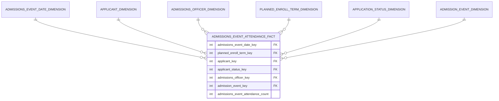
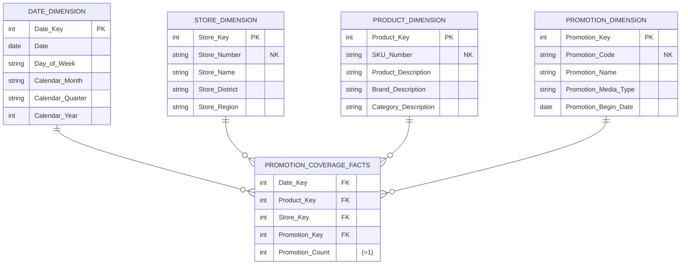
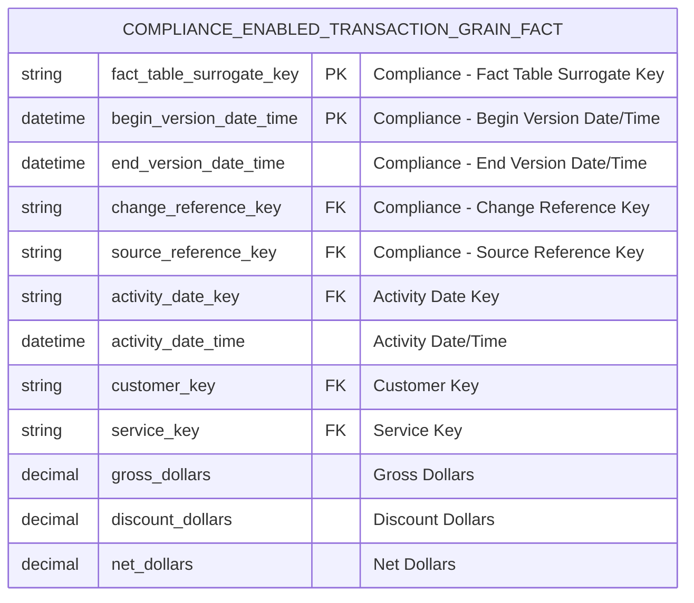
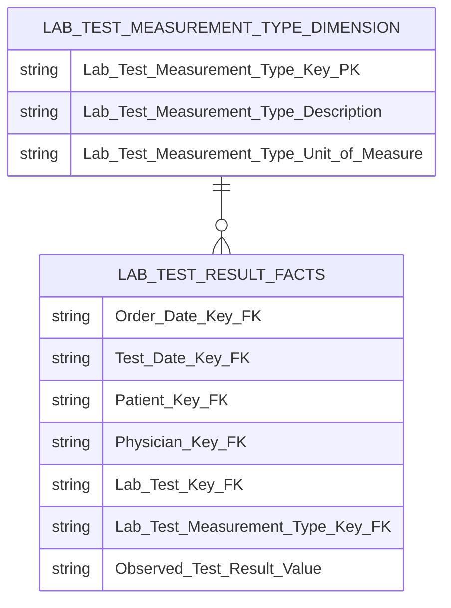

[[Dimensional Modeling]]
[[Book - The Data Warehouse Toolkit]]


A fact table represents the robust set of many-to-many relationships among dimensions; it records the collision of dimensions at a point in time and space. Each **fact table** typically has 5 to approximately 20 foreign key columns, followed by one to potentially several dozen numeric, continuously valued, preferably **additive facts**. The facts can be regarded as measurements taken at the intersection of the dimension key values. A dimension table describes a static entity. A fact table records an event or relationship across **multiple entities**.
## Fact Surrogate Keys

We often recommend designing fact tables with a single column primary surrogate key. This surrogate key is a simple integer that is assigned in sequence as rows are created to be added to the fact table. With the fact table surrogate key, you can easily resume a load that is halted or back out all the rows in the load by constraining on a range of surrogate keys.

Fact table surrogate keys have a number of uses in the ETL back room. First, as previously described, they can be used as the basis for backing out or resuming an interrupted load. Second, they provide immediate and unambiguous identification of a single fact row without needing to constrain multiple dimensions to fetch a unique row. Third, updates to fact table rows can be replaced by inserts plus deletes because the fact table surrogate key is now the actual key for the fact table. Thus, a row containing updated columns can be inserted into the fact table without overwriting the row it is to replace. When all such insertions are complete, then the underlying old rows can be deleted in a single step. Fourth, the fact table surrogate key is an ideal parent key to be used in a parent/child design. The fact table surrogate key appears as a foreign key in the child, along with the parent’s dimension foreign keys.
## Fact Table Types

Often it makes sense to utilize all three fact table types to meet various needs. Periodic history can be captured with periodic extracts, and all the infinite details involved in the process can be captured in an associated transaction grain fact table. The presence of many situations that violate standard scenarios or involve repeated looping though the process would prohibit the use of an accumulating snapshot.
### Transaction Fact Table
A row in a **transaction fact table** corresponds to a measurement event at a point in space and time. Atomic transaction grain fact tables are the most dimensional and expressive fact tables; this robust dimensionality enables the maximum slicing and dicing of transaction data. Transaction fact tables may be dense or sparse because rows exist only if measurements take place. These fact tables always contain a foreign key for each associated dimension, and optionally contain precise time stamps and degenerate dimension keys. The measured numeric facts must be consistent with the transaction grain.

The transaction grain represents a measurement event defined at a particular instant. A line item on an invoice is an example of a transaction event. A scanner event at a cash register is another. In these cases, the time stamp in the fact table is very simple. It’s either a single daily grain foreign key or a pair consisting of a daily grain foreign key together with a date/time stamp, depending on what the source system provides and the analyses require. The facts in this transaction table must be true to the grain and should describe only what took place in that instant.
Transaction grain fact tables are the largest and most detailed of the three types of fact tables. The transaction fact table loader receives data from the changed data capture system and loads it with the proper dimensional foreign keys. The pure addition of the most current records is the easiest case: simply bulk loading new rows into the fact table. In most cases, the target fact table should be partitioned by time to ease the administration and speed the performance of the table. An audit
key, sequential ID, or date/time stamp column should be included to allow backup or restart of the load job.

The addition of late arriving data is more difficult, requiring additional processing capabilities. In the event it is necessary to update existing rows, this process should be handled in two phases. The first step is to insert the corrected rows without overwriting or deleting the original rows, and then delete the old rows in a second step. Using a sequentially assigned single surrogate key for the fact table makes it possible to perform the two steps of insertion followed by deletion.

The transaction fact table records individual transactions at the most atomic level of detail. Each row transactional fact table represents a single event, such as a sales transaction or an order fulfillment event, making these fact tables ideal for detailed analysis of daily business activities.

Characteristics:

- Captures data at a granular level.
- Stores additive measures such as sales quantity or sales revenue.
- A primary key is often a composite key consisting of foreign keys from dimension tables like date, product, and customer.
- Allows easy tracking of individual transactions for reporting purposes.

Example: A sales fact table that records data warehouses each sales transaction, including the date, product sold, and amount.

### Periodic Snapshot Fact Table
A row in a **periodic snapshot fact table** summarizes many measurement events occurring over a standard period, such as a day, a week, or a month. The grain is the period, not the individual transaction. Periodic snapshot fact tables often contain many facts because any measurement event consistent with the fact table grain is permissible. These fact tables are uniformly dense in their foreign keys because even if no activity takes place during the period, a row is typically inserted in the fact table containing a zero or null for each fact.

The **periodic snapshot** grain represents a regular repeating measurement or set of measurements, like a bank account monthly statement. This fact table also has a single date column, representing the overall period. The facts in this periodic snapshot table must be true to the grain and should describe only measures appropriate to the timespan defined by the period. Periodic snapshots are a common fact table type and are frequently used for account balances, monthly financial reporting, and inventory balances. The periodicity of a periodic snapshot is typically daily, weekly, or monthly.
Periodic snapshots have similar loading characteristics to those of transaction grain fact tables. The same processing applies for inserts and updates. Assuming data is promptly delivered to the ETL system, all records for each periodic load can cluster in the most recent time partition. Traditionally, periodic snapshots have been loaded en masse at the end of the appropriate period. 
More frequently, organizations will populate a **hot rolling periodic snapshot**. In addition to the rows loaded at the end of every month, there are special rows loaded with the most current balances in effect as of the previous day. As the month progresses, the current month rows are continually updated with the most current information and continue in this manner rolling through the month.

A full periodic snapshot table or fact table summarizes business activities over a defined period, such as daily, weekly, or monthly. Unlike transaction fact tables, periodic snapshot tables do not store individual transactions but provide a performance summary at regular intervals.

**Characteristics**:

- Useful for [trend analysis](https://www.sprinkledata.com/blogs/mastering-trend-analysis-a-comprehensive-guide-to-uncover-insights).
- Stores semi-additive measures, such as account balances that can be summed over some dimensions but not others.
- Ideal for trend analysis over time (e.g., daily sales volume or inventory levels at the end of each day).

Example: A snapshot fact table that shows the total sales revenue and the number of orders at the end of each month.

### Accumulating snapshot
A row in an **accumulating snapshot fact table** summarizes the measurement events occurring at predictable steps between the beginning and the end of a process. Pipeline or workflow processes, such as order fulfillment or claim processing, that have a defined start point, standard intermediate steps, and defined end point can be modeled with this type of fact table. There is a date foreign key in the fact table for each critical milestone in the process. An individual row in an accumulating snapshot fact table, corresponding for instance to a line on an order, is initially inserted when the order line is created. As pipeline progress occurs, the accumulating fact table row is revisited and updated. This consistent updating of accumulating snapshot fact rows is unique among the three types of fact tables. In addition to the date foreign keys associated with each critical process step, accumulating snapshot fact tables contain foreign keys for other dimensions and optionally contain degenerate dimensions. They often include numeric lag measurements consistent with the grain, along with milestone completion counters.
#### Orders
The accumulating snapshot grain represents the current evolving status of a process that has a finite beginning and end. Usually, these processes are of short duration and therefore don’t lend themselves to the periodic snapshot. Order processing is the classic example of an accumulating snapshot. The order is placed, shipped, and paid for within one reporting period. The transaction grain provides too much detail separated into individual fact table rows, and the periodic snapshot just is the wrong way to report this data.
The design and administration of the accumulating snapshot is quite different from the first two fact table types. All accumulating snapshot fact tables have a set of dates which describe the typical process workflow. For instance, an order might have an order date, actual ship date, delivery date, final payment date, and return date. In this example, these five dates appear as five separate date-valued foreign surrogate keys. When the order row is first created, the first of these dates is well defined, but perhaps none of the others have yet happened. This same fact row is subsequently revisited as the order winds its way through the order pipeline. Each time something happens, the accumulating snapshot fact row is destructively modified. The date foreign keys are overwritten, and various facts are updated. Often the first date remains inviolate because it describes when the row was created, but all the other dates may well be overwritten, sometimes
more than once.

#### Insurance
https://www.kimballgroup.com/2011/11/design-tip-140-is-it-a-dimension-a-fact-or-both/

For most subject areas, it’s pretty easy to identify the major dimensions: Product, Customer Account, Student, Employee, and Organization are all easily understood as descriptive dimensions. A store’s sales, a telecommunication company’s phone calls, and a college’s course registrations are all clearly facts.

However, for some subject areas, it can be challenging – especially for the new dimensional modeler – to identify whether an entity is a dimension or a fact. For example, an **insurance company’s claims** processing unit wants to analyze and report on their open claims. “Claim” feels like a dimension, but at the same time, it can behave like a fact table. A similar situation arises with software companies with **extended sales cycles**: is the sales opportunity a dimension, a fact, or both?

In most cases, the design puzzle is solved by recognizing that the business event you’re trying to represent in the fact table is actually a long-lived process or lifecycle. Often, the business users are most interested in seeing the current state of the process. A table with one row per process – one row per claim or sales opportunity, for example – sounds like a dimension table. But if you distinguish between the entity (claim or sales opportunity) and the process (claim settlement or sales pipeline), it becomes clearer. We need a fact table to measure the process. And many dimension tables to describe the attributes of the entity measured in that process.

This type of schema is implemented as an accumulating snapshot. The accumulating snapshot is less common than transactional and periodic snapshot fact tables. The grain of this type of fact table is one row per process; it has many roles of the date dimension; and the fact table rows are updated multiple times over the life of the process (hence the name accumulating snapshot). 

Many of the core dimensions of an accumulating snapshot schema are easy to identify, but there are some challenges to these designs. Long-lived processes tend to have a lot of little flags and codes from the source system that signal various statuses and conditions in the process. These are great candidates for junk dimensions. Expect your accumulating snapshot schema to have several junk dimensions.

An **accumulating snapshot fact table** tracks the progress of events that have a defined life cycle, such as the order fulfillment process. These periodic snapshot fact tables capture the evolving state of a process from start to finish by updating rows as the process advances through its stages.

**Characteristics**:

- Useful for tracking processes with multiple stages.
- Semi-additive measures are typically used.
- The same row is updated multiple times as the process progresses, with foreign keys tracking each stage.
- Accumulative snapshot tables capture business processes such as order processing, where each row represents an order moving through stages like "order received", "order shipped", and "order completed".

**Example**: An accumulating snapshot fact table that tracks an order through the stages of processing, shipping, and delivery.

Accumulating snapshot fact tables depend on a series of dates that implement the “standard scenario” for the pipeline process. For order fulfillment, you may have the steps of order created, order shipped, order delivered, order paid, and order returned as standard steps in the order scenario. This kind of design is successful when 90 percent or more of the orders progress through these steps (hopefully without the return) without any unusual exceptions.

But if an occasional situation deviates from the standard scenario, you don’t have a good way to reveal what happened. For example, maybe when the order was shipped, the delivery truck had a fl at tire. A decision was made to unload the delivery to another truck, but unfortunately it began to rain and the shipment was water damaged. Then it was refused by the customer, and ultimately there was a lawsuit. None of these unusual steps are modeled in the standard scenario in the accumulating snapshot. Nor should they be!

The way to describe unusual departures from the standard scenario is to add a delivery status dimension to the accumulating snapshot fact table. For the case of the weird delivery scenario, you tag this order fulfillment row with the status Weird. Then if the analyst wants to see the complete story, the analyst can join to a companion transaction fact table through the order number and line number that has every step of the story. The transaction fact table joins to a transaction dimension, which indeed has Flat Tire, Damaged Shipment, and Lawsuit as transactions. Even though this transaction dimension will grow over time with unusual entries, it is well bounded and stable.

#### Less predictable pipelines

Accumulating snapshot fact tables are typically appropriate for predictable workflows with well-established milestones. They usually have five to 10 key milestone dates representing the pipeline’s start, completion, and key events in between. However, sometimes workflows are less predictable. They still have a definite start and end date, but the milestones in between are numerous and less stable. Some occurrences may skip over some intermediate milestones, but there’s no reliable pattern.
In this situation, the first task is to identify the key dates that link to role-playing date dimensions. These dates represent the most important milestones. The start and end dates for the process would certainly qualify; in addition, you should consider other commonly occurring critical milestones. These dates (and their associated dimensions) will be used extensively for BI application filtering. However, if the number of additional milestones is both voluminous and unpredictable, they can’t all be handled as additional date foreign keys in the fact table.

Typically, business users are more interested in the lags between these milestones, rather than filtering or grouping on the dates themselves. If there were a total of 20 potential milestone events, there would be 190 potential lag durations: event A-to-B, A-to-C, … (19 possible lags from event A), B-to-C, … (18 possible lags from event B), and so on. Instead of physically storing all possible lag metrics, you can get away with just storing 19 of them and then calculate the others. Because every pipeline occurrence starts by passing through milestone A, which is the workflow begin date, you could store all 19 lags from the anchor event A and then calculate the other variations. For example, if you want to know the lag from B-to-C, take the A-to-C lag value and subtract the A-to-B lag. If there happens to be a null for one of the lags involved in a calculation, then the result also needs to be null because one of the events never occurred. But such a null result is handled gracefully if you are counting or averaging that lag across a number of claim rows.

### Timespan fact table

A **timespan fact table** stores a transaction/event together with:

1. **The timestamp when the transaction occurred**
2. **The timestamp when the next transaction occurred**

This turns each transaction into a **time interval**.

```text
transaction_time              next_transaction_time
       ↓                               ↓
       |-------------------------------|
              customer's state
```

The key idea is that each row represents the customer's state from its transaction timestamp until the next transaction timestamp. Suppose a customer has these events:

|Event|Transaction Time|Next Transaction|State|
|---|---|---|---|
|Fraud alert started|Jan 10|Jan 20|Fraud alert|
|Fraud alert ended|Jan 20|Feb 5|Normal|
|Fraud alert started|Feb 5|Feb 12|Fraud alert|
|Fraud alert ended|Feb 12|Mar 1|Normal|

The rows now represent intervals:

```text
Jan 10 ───────── Jan 20 ───────── Feb 5 ─────── Feb 12 ───────── Mar 1
   |                 |                |              |
   └─ FRAUD ─────────┘                └─ FRAUD ──────┘
                     └──── NORMAL ────┘
```

The first row effectively means that the customer was on **fraud alert from Jan 10 until Jan 20**. Without `next_transaction_time`, you only know **when something happened**. With it, you know **how long that state remained valid**. The important trick is that you often **don't know the end time when the transaction happens**.

Timespan fact tables transform a sequence of transactions into continuous time intervals, making it possible to efficiently reconstruct the state of something at any arbitrary point in the past.

Using the pair of date/time stamps requires a two-step process whenever a new transaction row is entered. In the first step, the end effective date/time stamp of the most current transaction must be set to a fictitious date/time far in the future. Although it would be semantically correct to insert NULL for this date/time, nulls become a headache when you encounter them in constraints because they can cause a database error when you ask if the field is equal to a specific value. By using a fictitious date/time far in the future, this problem is avoided.

In the second step, after the new transaction is entered into the database, the ETL process must retrieve the previous transaction and set its end effective date/time to the date/time of the newly entered transaction. Although this two-step process is a noticeable cost of this twin date/time approach, it is a classic and desirable trade-off between extra ETL overhead in the back room and reduced query complexity in the front room.

### Timespan Accumulating Snapshot

https://www.kimballgroup.com/2012/05/design-tip-145-time-stamping-accumulating-snapshot-fact-tables/

The accumulating snapshot does a great job of telling us the pipeline’s current state, but it glosses over the intermediate states. For example, a claim may move in and out of states multiple times: opened, denied, protested, re-opened, re-closed. The accumulating snapshot is hugely valuable, but there are several things that it cannot do:

- It can’t tell us the details of when and why the claim looped through states multiple times.
- We can’t recreate our “book of business” at any arbitrary date in the past.

For example, a claim can move in and out of various states such as opened, denied, closed, disputed, opened again, and closed again. The claim transaction fact table will have separate rows for each of these events, but it doesn’t accumulate metrics across transactions; trying to re-create the evolution of a workflow from these transactional events would be a nightmare. Meanwhile, a classic accumulating snapshot doesn’t allow you to re-create the claim workflow at any arbitrary date in the past.

To solve both of these problems, we’ll need two fact tables. A transaction fact table captures the details of individual state changes. Then we’ll add effective and expiration dates to the accumulating snapshot fact table to capture its history.

The transaction fact table is straightforward. We often pair the accumulating snapshot fact table with a transaction fact table that contains a row for each state change. Where the accumulating snapshot has **one row per pipeline process** such as a claim, the transaction fact table has **one row per event**. Depending on your source systems, it’s common to build the transaction fact table first, and derive the accumulating snapshot from it.

Now let’s turn our attention to the **timespan accumulating snapshot fact table**. First of all, not everyone needs to bother with retaining these time stamped snapshots. For most organizations, a standard accumulating snapshot representing the current state of the pipeline, combined with the transaction fact table to show the event details, is ample. However, we’ve worked with several organizations that need to understand the evolution of a pipeline. While it’s technically possible to do that from the transaction data, it’s not child’s play.

One solution to the historical pipeline tracking requirement is to combine the accumulating snapshot with a **periodic snapshot**: snap a picture of the pipeline at a regular interval. This brute force method is overkill for pipelines that are relatively long in overall duration, but change infrequently. What works best in this case is to add effective and expiration change tracking to the accumulating snapshot. Here’s how it works:

- Design a standard accumulating snapshot fact table.
- Instead of updating each row as it changes state, add a new row. Our recent designs have been at the daily grain: add a new row to the fact table any day in which something about that pipeline (e.g., claim, sales process, or drug adverse reaction) has changed.
- You need some additional metadata columns, similar to a type 2 dimension:
    - snapshot start date: the date this row became effective.
    - snapshot end date: the date this row expired, updated when a new row is added.
    - snapshot current flag: updated when we add a new row for this pipeline occurrence.

Most users are only interested in the current view, i.e., a standard accumulating snapshot. You can meet their needs by defining a view (probably an indexed or materialized view) that filters the historical snapshot rows based on snapshot current flag. Alternatively, you may choose to instantiate a physical table of current rows at the end of each day’s ETL. The minority of users and reports who need to look at the pipeline as of any arbitrary date in the past can do so easily by filtering on the snapshot start and end  
dates.

The timespan accumulating snapshot fact table is slightly more complicated to maintain than a standard accumulating snapshot, but the logic is similar. Where the accumulating snapshot will update a row, the time stamped snapshot updates the row formerly-known-as-current and inserts a new row. The big difference between the standard and time stamped accumulating snapshots is the fact table row count. If an average claim is changed on twenty days during its life, the time stamped snapshot will be twenty times bigger than the standard accumulating snapshot. Take a look at your data and your business’s requirements to see if it makes sense for you. In our recent designs, we’ve been pleasantly surprised by how efficient this design is. Although a few problematic pipeline occurrences were changed hundreds of times, the vast majority were handled and closed with a modest number of changes.

### Factless Fact Table
Although most measurement events capture numerical results, it is possible that the event merely records a set of dimensional entities coming together at a moment in time. For example, an event of a student attending a class on a given day may not have a recorded numeric fact, but a fact row with foreign keys for calendar day, student, teacher, location, and class is well-defined. Likewise, customer communications are events, but there may be no associated metrics. **Factless fact tables** can also be used to analyze what didn’t happen. These queries always have two parts: a factless coverage table that contains all the possibilities of events that might happen and an activity table that contains the events that did happen. When the activity is subtracted from the coverage, the result is the set of events that did not happen.

A **factless fact table** contains only foreign keys from related dimension tables and no numerical or quantitative measures. These tables are used to capture the many-to-many relationships between dimensions or to track events affiliate dimensions that don’t involve any numeric data but are important for analysis.

**Characteristics**:

- No additive measures; contains only foreign keys.
- Useful for tracking occurrences of events such as student attendance, promotional activities, or shipping delays.

**Example**: A fact table that records [data analyst](https://www.sprinkledata.com/blogs/data-analyst-vs-data-scientist-an-in-depth-comparison-between-data-professionals) the participation of students in classes without recording any quantitative measures.

**Events** are modeled as fact tables containing a series of keys, each representing a participating dimension in the event. Event tables sometimes have no variable measurement facts associated with them and hence are called factless fact tables.

There are a number of business processes whose fact tables have no measured facts. You can envision a **factless fact table** to track each prospective student’s attendance at an admission event, such as a high school visit, college fair, alumni interview or campus overnight.




The only peculiarity in these examples is that you don’t have a numeric fact tied to this registration data. As such, analyses of this data will be based largely on **counts**. Some designers to create an artificial implied fact, perhaps called *course_registration* count (as opposed to “dummy”), that is always populated by the value 1. Although this fact does not add any information to the fact table, it makes the SQL more readable, such as:

```sql
select faculty, sum(registration_count)... group by faculty
```

At this point the table is no longer strictly factless, but the “1” is nothing more than an artifact. The SQL will be a bit cleaner and more expressive with the registration count. Some BI query tools have an easier time constructing this query with a few simple user gestures. More important, if you build a summarized aggregate table above this fact table, you need a real column to roll up to meaningful aggregate registration counts. Finally, if deploying to an OLAP cube, you typically include an explicit count column (always equal to 1) for complex counts because the dimension join keys are not explicitly revealed in a cube.

The second type of factless fact table deals with **coverage**, which can be illustrated with a facilities management scenario. Universities invest a tremendous amount of capital in their physical plant and facilities. It would be helpful to understand which facilities were being used for what purpose during every hour of the day during each term. For example, which facilities were used most heavily? What was the average occupancy rate of the facilities as a function of time of day? Does utilization drop off significantly on Fridays when no one wants to attend (or teach) classes? Again, the factless fact table comes to the rescue. In this case you’d insert one row in the fact table for each facility for standard hourly time blocks during each day of the week during a term regardless of whether the facility is being used.

The facility dimension would include all types of descriptive attributes about the facility, such as the building, facility type, capacity, and amenities. The utilization status dimension would include a text descriptor with values of *Available* or *Utilized*.

You can visualize a similar schema to track student attendance in a course. In this case, the grain would be one row for each student who walks through the course’s classroom door each day.

In Retail, we may want to know which products were on promotion but did not sell. The sales fact table records only the SKUs actually sold. There are no fact table rows with zero facts for SKUs that didn’t sell because doing so would enlarge the fact table enormously. In the relational world, a promotion coverage or event fact table is needed to answer the question concerning what didn’t happen. The **promotion coverage fact table** keys would be date, product, store, and promotion in this case study. You’d load one row for each product on promotion in a store each day (or week, if retail promotions are a week in duration) regardless of whether the product sold. This fact table enables you to see the relationship between the keys as defined by a promotion, independent of other events, such as actual product sales. We refer to it as a factless fact table because it has no measurement metrics; it merely captures the relationship between the involved keys.



To determine what products were on promotion but didn’t sell requires a two-step process. First, you’d query the promotion factless fact table to determine the universe of products that were on promotion on a given day. You’d then determine what products sold from the POS sales fact table. The answer to our original question is the set difference between these two lists of products.

#### Events that didn't occur
 
 Perhaps people are interested in monitoring students who were registered for a course but didn’t show up. In this example you can envision adding explicit rows to the fact table for attendance events that didn’t occur. The fact table would no longer be factless as there is an attendance metric equal to either 1 or 0.
 
Adding rows is viable in this scenario because the non-attendance events have the same exact dimensionality as the attendance events. Likewise, the fact table won’t grow at an alarming rate, presuming (or perhaps hoping) the no-shows are a small percentage of the total students registered for a course. Although this approach is reasonable in this scenario, creating rows for events that didn’t happen is ridiculous in many other situations, such as adding rows to a customer’s sales transaction for promoted products that weren’t purchased by the customer.

### Aggregate Fact Tables

Aggregate fact tables are simple numeric rollups of atomic fact table data built solely to accelerate query performance. These aggregate fact tables should be available to the BI layer at the same time as the atomic fact tables so that BI tools smoothly choose the appropriate aggregate level at query time. This process, known as aggregate navigation, must be open so that every report writer, query tool, and BI application harvests the same performance benefits. A properly designed set of aggregates should behave like database indexes, which accelerate query performance but are not encountered directly by the BI applications or business users. Aggregate fact tables contain foreign keys to shrunken conformed dimensions, as well as aggregated facts created by summing measures from more atomic fact tables.
## Compliance-Enabled Fact Table

In highly compliant environments, supporting compliance requirements is a significant new requirement for the ETL team. Compliance in the data warehouse involves “maintaining the chain of custody” of the data. In the same way a police department must carefully maintain the chain of custody of evidence to argue that the evidence has not been changed or tampered with, the data warehouse must also carefully guard the compliance-sensitive data entrusted to it from the moment it arrives. Furthermore, the data warehouse must always show the exact condition and content of such data at any point in time that it may have been under the control of the data warehouse. The data warehouse must also track who had authorized access to the data. Finally, when the suspicious auditor looks over your shoulder, you need to link back to an archived and time-stamped version of the data as it was originally received, which you have stored remotely with a trusted third party.

The compliance requirements may mean you cannot actually change any data, for
any reason. If data must be altered, then a new version of the altered records must
be inserted into the database. Each row in each table therefore must have begin
and end time stamps that accurately represents the span of time when the record
was the “current truth.” The big impact of these compliance requirements on the
data warehouse can be expressed in simple dimensional modeling terms. Type 1
and type 3 changes are dead. In other words, all changes become inserts. No more
deletes or overwrites.

A fact table can be augmented so that overwrite changes are converted into a fact table equivalent of a type 2 change. The original fact table consisted of the lower seven columns starting with activity date and ending with net dollars. The original fact table allowed overwrites. For example, perhaps there is a business rule that updates the discount and net dollar amounts after the row is originally created. In the original version of the table, history is lost when the over-
write change takes place, and the chain of custody is broken.



To convert the fact table to be compliance-enabled, five columns are added. A **fact table surrogate key** is created for each original unmodified fact table row. This surrogate key, like a dimension table surrogate key, is just a unique integer that is assigned as each original fact table row is created. The **begin version date/time stamp** is the exact time of creation of the fact table row. Initially, the **end version date/time** is set to a fictitious date/time in the future. The change reference is set to “original,” and the source reference is set to the operational source.

When an overwrite change is needed, a new row is added to the fact table with the **same fact table surrogate key**, and the appropriate regular columns changed, such as discount dollars and net dollars. The **begin version date/time** column is set to the exact date/time when the change in the database takes place. The **end version date/ time** is set to a fictitious date/time in the future. The end version date/time of the original fact row is now set to the exact date/time when the change in the database takes place. The change reference now provides an explanation for the change, and the source reference provides the source of the revised columns.

If the compliance-enabled table is actually used for only demonstrating compliance, then a normal version of the fact table with just the original columns can remain as the main operational table, with the compliance-enabled table existing only in the background. For heaven’s sake, don’t assume that all data is now subject to draconian compliance restrictions. It is essential you receive fi rm guidelines from the chief compliance officer before taking any drastic steps.

## Measure Type Dimension for Sparse Facts

As designers, it is tempting to strive for a more standardized framework that could be extended to handle data variability. For example, you could potentially handle the variability of lab test results with a measurement type dimension describing what the fact row means, or in other words, what the generic fact represents. The unit of measure for a given numeric entry is found in the associated measurement type dimension row, along with any additivity restrictions.



This approach is **superbly flexible**; you can add new measurement types simply by adding new rows in the measurement type dimension, not by altering the structure of the fact table. This approach also eliminates the nulls in the classic positional fact table design because a row exists only if the measurement exists.

However, there are trade-offs. Using a measurement type dimension may generate lots of new fact table rows because the grain is “one row per measurement per event” rather than the more typical “one row per event.” If a lab test results in 10 numeric measurements, there are now 10 rows in the fact table rather than a single row in the classic design. For **extremely sparse** situations, such as clinical laboratory or manufacturing test environments, this is a reasonable compromise. However, as the density of the facts grows, you end up spewing out too many fact rows. At this point you no longer have sparse facts and should return to the classic fact table design with fixed columns.

Moreover, this measurement type approach may complicate BI data access applications. In the relational star schema, combining two numbers that were captured as part of a single event is more difficult with this approach because now you must fetch two rows from the fact table. SQL likes to perform arithmetic functions within a row, not across rows. In addition, you must be careful not to mix incompatible amounts in a calculation because all the numeric measures reside in a single amount column.

## Fact Provider System

The fact provider is responsible for receiving conformed dimensions from the dimension managers. The fact provider owns the administration of one or more fact tables and is responsible for their creation, maintenance, and use. If fact tables are used in any drill-across applications, then by definition the fact provider must be using conformed dimensions provided by the dimension manager. The fact provider’s responsibilities are more complex and include:

- Receive or download replicated dimension from the dimension manager.
- In an environment in which the dimension cannot simply be replicated but must be locally updated, the fact provider must process dimension records marked as new and current to update current key maps in the surrogate key pipeline and also process any dimension records marked as new but postdated.
- Add all new rows to fact tables after replacing their natural keys with correct surrogate keys.
- Modify rows in all fact tables for error correction, accumulating snapshots, and late arriving dimension changes.
- Remove aggregates that have become invalidated.
- Recalculate affected aggregates. If the new release of a dimension does not change the version number, aggregates have to be extended to handle only newly loaded fact data. If the version number of the dimension has changed, the entire historical aggregate may have to be recalculated.
- Quality ensure all base and aggregate fact tables. Be satisfi ed the aggregate tables are correctly calculated.
- Bring updated fact and dimension tables online.
- Inform users that the database has been updated. Tell them if major changes have been made, including dimension version changes, postdated records being added, and changes to historical aggregates.

