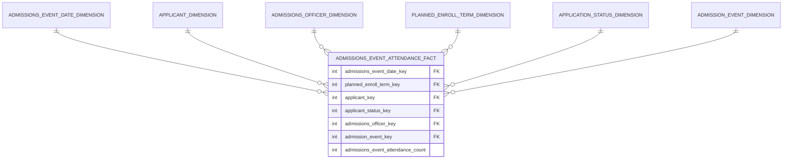
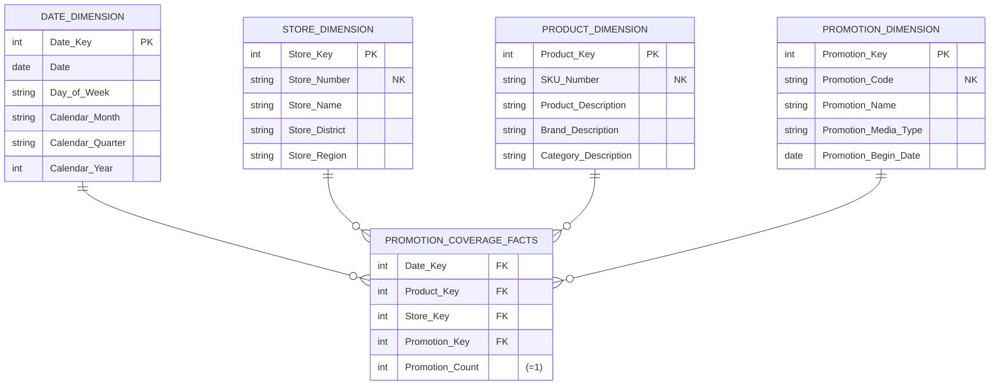

[[Dimensional Modeling]]
[[Book - The Data Warehouse Toolkit]]

A fact table represents the robust set of many-to-many relationships among dimensions; it records the collision of dimensions at a point in time and space. Each **fact table** typically has 5 to approximately 20 foreign key columns, followed by one to potentially several dozen numeric, continuously valued, preferably **additive facts**. The facts can be regarded as measurements taken at the intersection of the dimension key values. A dimension table describes a static entity. A fact table records an event or relationship across **multiple entities**.

## Accumulating snapshot

Accumulating snapshot fact tables depend on a series of dates that implement the “standard scenario” for the pipeline process. For order fulfillment, you may have the steps of order created, order shipped, order delivered, order paid, and order returned as standard steps in the order scenario. This kind of design is successful when 90 percent or more of the orders progress through these steps (hopefully without the return) without any unusual exceptions.

But if an occasional situation deviates from the standard scenario, you don’t have a good way to reveal what happened. For example, maybe when the order was shipped, the delivery truck had a fl at tire. A decision was made to unload the delivery to another truck, but unfortunately it began to rain and the shipment was water damaged. Then it was refused by the customer, and ultimately there was a lawsuit. None of these unusual steps are modeled in the standard scenario in the accumulating snapshot. Nor should they be!

The way to describe unusual departures from the standard scenario is to add a delivery status dimension to the accumulating snapshot fact table. For the case of the weird delivery scenario, you tag this order fulfillment row with the status Weird. Then if the analyst wants to see the complete story, the analyst can join to a companion transaction fact table through the order number and line number that has every step of the story. The transaction fact table joins to a transaction dimension, which indeed has Flat Tire, Damaged Shipment, and Lawsuit as transactions. Even though this transaction dimension will grow over time with unusual entries, it is well bounded and stable.

## Factless Fact Table

**Events** are modeled as fact tables containing a series of keys, each representing a participating dimension in the event. Event tables sometimes have no variable measurement facts associated with them and hence are called factless fact tables.

There are a number of business processes whose fact tables have no measured facts. You can envision a **factless fact table** to track each prospective student’s attendance at an admission event, such as a high school visit, college fair, alumni interview or campus overnight.




The only peculiarity in these examples is that you don’t have a numeric fact tied to this registration data. As such, analyses of this data will be based largely on **counts**. Some designers to create an artificial implied fact, perhaps called *course_registration* count (as opposed to “dummy”), that is always populated by the value 1. Although this fact does not add any information to the fact table, it makes the SQL more readable, such as:

```sql
select faculty, sum(registration_count)... group by faculty
```

At this point the table is no longer strictly factless, but the “1” is nothing more than an artifact. The SQL will be a bit cleaner and more expressive with the registration count. Some BI query tools have an easier time constructing this query with a few simple user gestures. More important, if you build a summarized aggregate table above this fact table, you need a real column to roll up to meaningful aggregate registration counts. Finally, if deploying to an OLAP cube, you typically include an explicit count column (always equal to 1) for complex counts because the dimension join keys are not explicitly revealed in a cube.

The second type of factless fact table deals with **coverage**, which can be illustrated with a facilities management scenario. Universities invest a tremendous amount of capital in their physical plant and facilities. It would be helpful to understand which facilities were being used for what purpose during every hour of the day during each term. For example, which facilities were used most heavily? What was the average occupancy rate of the facilities as a function of time of day? Does utilization drop off significantly on Fridays when no one wants to attend (or teach) classes? Again, the factless fact table comes to the rescue. In this case you’d insert one row in the fact table for each facility for standard hourly time blocks during each day of the week during a term regardless of whether the facility is being used.

The facility dimension would include all types of descriptive attributes about the facility, such as the building, facility type, capacity, and amenities. The utilization status dimension would include a text descriptor with values of *Available* or *Utilized*.

You can visualize a similar schema to track student attendance in a course. In this case, the grain would be one row for each student who walks through the course’s classroom door each day.

In Retail, we may want to know which products were on promotion but did not sell. The sales fact table records only the SKUs actually sold. There are no fact table rows with zero facts for SKUs that didn’t sell because doing so would enlarge the fact table enormously. In the relational world, a promotion coverage or event fact table is needed to answer the question concerning what didn’t happen. The **promotion coverage fact table** keys would be date, product, store, and promotion in this case study. You’d load one row for each product on promotion in a store each day (or week, if retail promotions are a week in duration) regardless of whether the product sold. This fact table enables you to see the relationship between the keys as defined by a promotion, independent of other events, such as actual product sales. We refer to it as a factless fact table because it has no measurement metrics; it merely captures the relationship between the involved keys.



To determine what products were on promotion but didn’t sell requires a two-step process. First, you’d query the promotion factless fact table to determine the universe of products that were on promotion on a given day. You’d then determine what products sold from the POS sales fact table. The answer to our original question is the set difference between these two lists of products.

### Events that didn't occur
 
 Perhaps people are interested in monitoring students who were registered for a course but didn’t show up. In this example you can envision adding explicit rows to the fact table for attendance events that didn’t occur. The fact table would no longer be factless as there is an attendance metric equal to either 1 or 0.
 
Adding rows is viable in this scenario because the non-attendance events have the same exact dimensionality as the attendance events. Likewise, the fact table won’t grow at an alarming rate, presuming (or perhaps hoping) the no-shows are a small percentage of the total students registered for a course. Although this approach is reasonable in this scenario, creating rows for events that didn’t happen is ridiculous in many other situations, such as adding rows to a customer’s sales transaction for promoted products that weren’t purchased by the customer.
## Timespan

A **timespan fact table** stores a transaction/event together with:

1. **The timestamp when the transaction occurred**
2. **The timestamp when the next transaction occurred**

This turns each transaction into a **time interval**.

```text
transaction_time              next_transaction_time
       ↓                               ↓
       |-------------------------------|
              customer's state
```

The key idea is that each row represents the customer's state from its transaction timestamp until the next transaction timestamp. Suppose a customer has these events:

|Event|Transaction Time|Next Transaction|State|
|---|---|---|---|
|Fraud alert started|Jan 10|Jan 20|Fraud alert|
|Fraud alert ended|Jan 20|Feb 5|Normal|
|Fraud alert started|Feb 5|Feb 12|Fraud alert|
|Fraud alert ended|Feb 12|Mar 1|Normal|

The rows now represent intervals:

```text
Jan 10 ───────── Jan 20 ───────── Feb 5 ─────── Feb 12 ───────── Mar 1
   |                 |                |              |
   └─ FRAUD ─────────┘                └─ FRAUD ──────┘
                     └──── NORMAL ────┘
```

The first row effectively means that the customer was on **fraud alert from Jan 10 until Jan 20**. Without `next_transaction_time`, you only know **when something happened**. With it, you know **how long that state remained valid**. The important trick is that you often **don't know the end time when the transaction happens**.

Timespan fact tables transform a sequence of transactions into continuous time intervals, making it possible to efficiently reconstruct the state of something at any arbitrary point in the past.

Using the pair of date/time stamps requires a two-step process whenever a new transaction row is entered. In the first step, the end effective date/time stamp of the most current transaction must be set to a fictitious date/time far in the future. Although it would be semantically correct to insert NULL for this date/time, nulls become a headache when you encounter them in constraints because they can cause a database error when you ask if the fi eld is equal to a specific value. By using a fictitious date/time far in the future, this problem is avoided.

In the second step, after the new transaction is entered into the database, the ETL process must retrieve the previous transaction and set its end effective date/time to the date/time of the newly entered transaction. Although this two-step process is a noticeable cost of this twin date/time approach, it is a classic and desirable trade-off between extra ETL overhead in the back room and reduced query complexity in the front room.
