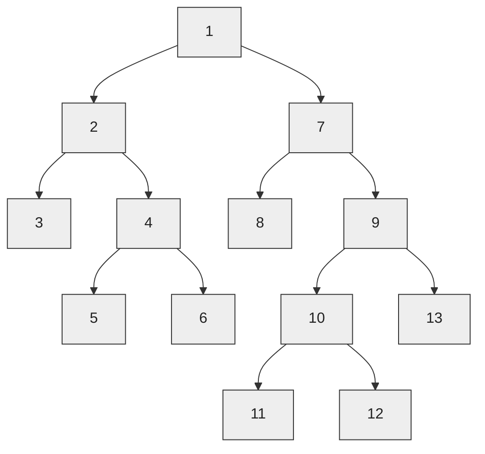
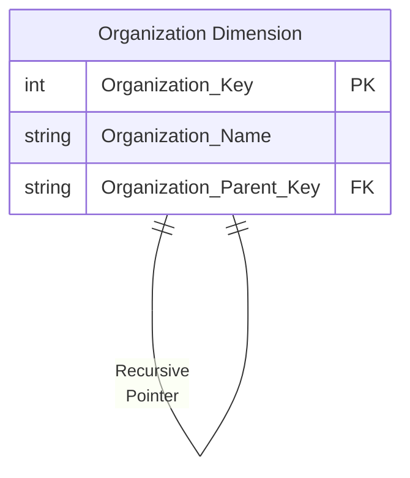
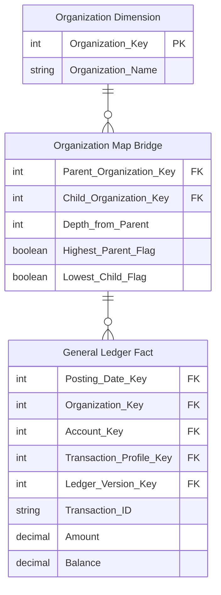

[[Dimension Tables]]
[[Book - The Data Warehouse Toolkit]] - Chapter 7 - Accounting

Imagine your enterprise consists of 13 organizations with the following rollup structure. Each of these organizations has its own budget, commitments, and payments. For a single organization, you can request a specific budget for an account with a simple join from the organization dimension to the fact table. But you also want to roll up the budget across portions of the tree or even all the tree. **Ragged Hierarchies** of indeterminate depth are difficult to model and query in a relational database.



## Recursive Pointers

The classic way to represent a parent/child tree structure is by placing recursive pointers in the organization dimension from each row to its parent.
```sql
CREATE TABLE COMPANY (
COMPANY_KEY INTEGER NOT NULL,
COMPANY_NAME VARCHAR(50),
PARENT_KEY INTEGER);
INSERT INTO COMPANY VALUES (100,'MICROSOFT',NULL);
INSERT INTO COMPANY VALUES (101,'SOFTWARE',100);
INSERT INTO COMPANY VALUES (102,'CONSULTING',101);
INSERT INTO COMPANY VALUES (103,'PRODUCTS',101);
INSERT INTO COMPANY VALUES (104,'OFFICE',103);
INSERT INTO COMPANY VALUES (105,'VISIO',104);
INSERT INTO COMPANY VALUES (106,'VISIO EUROPE',105);
INSERT INTO COMPANY VALUES (107,'BACK OFFICE',103);
INSERT INTO COMPANY VALUES (108,'SQL SERVER',107);
INSERT INTO COMPANY VALUES (109,'OLAP SERVICES',108);
INSERT INTO COMPANY VALUES (110,'DTS',108);
INSERT INTO COMPANY VALUES (111,'REPOSITORY',108);
INSERT INTO COMPANY VALUES (112,'DEVELOPER TOOLS',103);
INSERT INTO COMPANY VALUES (113,'WINDOWS',103);
INSERT INTO COMPANY VALUES (114,'ENTERTAINMENT',103);
INSERT INTO COMPANY VALUES (115,'GAMES',114);
INSERT INTO COMPANY VALUES (116,'MULTIMEDIA',114);
INSERT INTO COMPANY VALUES (117,'EDUCATION',101);
COMMIT;
```



The original definition of SQL did not provide a way to evaluate these recursive pointers. Oracle implemented a CONNECT BY function that traversed these pointers in a downward fashion starting at a high-level parent in the tree and progressively enumerated all the child nodes in lower levels until the tree was exhausted.

```sql
SELECT
    COMPANY_KEY,
    COMPANY_NAME,
    PARENT_KEY,
    LEVEL
FROM COMPANY
START WITH PARENT_KEY IS NULL
CONNECT BY PRIOR COMPANY_KEY = PARENT_KEY;
```

The problem with Oracle CONNECT BY and other more general approaches, such as SQL Server’s recursive common table expressions, is that the representation of the tree is entangled with the organization dimension because these approaches depend on the recursive pointer embedded in the data. It is impractical to switch from one rollup structure to another because many of the recursive pointers would have to be destructively modified. It is also impractical to maintain organizations as type 2 slowly changing dimension attributes because changing the key for a high-level node would ripple key changes down to the bottom of the tree.

101 Software
     ↓
103 Products
     ↓
104 Office
     ↓
105 Visio
     ↓
106 Visio Europe

The **ripple effect** happens because each organization stores the key of its parent. For example, if `SOFTWARE` has key `101` and `PRODUCTS` points to `101`, then `OFFICE` points to `PRODUCTS`, `VISIO` points to `OFFICE`, and so on. If `SOFTWARE` gets a new key, say `201`, because of a Type 2 slowly changing dimension change, `PRODUCTS` must now point to `201` instead of `101`. If `PRODUCTS` also receives a new key, that change must then be propagated to `OFFICE`, then `VISIO`, and potentially every descendant below it. Thus, changing one high-level organization can require updating keys throughout the entire branch of the hierarchy.

201 Software
     ↓
??? Products
     ↓
??? Office
     ↓
??? Visio
     ↓
??? Visio Europe

## Bridge Table

All these objections can be overcome in relational databases by modeling a ragged hierarchy with a specially constructed _bridge table_. This **bridge table** contains a row for every possible path in the ragged hierarchy and enables all forms of hierarchy traversal to be accomplished with standard SQL rather than using special language extensions.

The grain of this bridge table is each path in the tree from a parent to all the children below that parent. The first column in the map table is the primary key of the parent, and the second column is the primary key of the child. A row must be constructed from each possible parent to each possible child, including a row that connects the parent to itself.

|**Parent Organization Key**|**Child Organization Key**|**Depth from Parent**|**Highest Parent Flag**|**Lowest Child Flag**|
|---|---|---|---|---|
|1|1|0|TRUE|FALSE|
|1|2|1|TRUE|FALSE|
|1|3|2|TRUE|TRUE|
|1|4|2|TRUE|FALSE|
|1|5|3|TRUE|TRUE|
|...|...|...|...|...|

The **highest parent flag** in the map table means the particular path comes from the highest parent in the tree. The **lowest child flag** means the particular path ends in a “leaf node” of the tree. If you constrain the organization dimension table to a single row, you can join the dimension table to the map table to the fact table. For example, if you constrain the organization table to node number 1 and simply fetch an additive fact from the fact table, you traverse the entire tree in a single query. If you perform the same query except constrain the map table lowest child flag to true, then you fetch only the additive fact from the leaf nodes. 



You must be careful when using the map bridge table to constrain the organization dimension to a single row, or else you risk overcounting the children and grandchildren in the tree. For example, if instead of a constraint such as “Node Organization Number = 1” you constrain on “Node Organization Location = California”, you would have this problem.

## References

- [Kimball Group - Ragged variable depth hierarchy](https://www.kimballgroup.com/data-warehouse-business-intelligence-resources/kimball-techniques/dimensional-modeling-techniques/ragged-variable-depth-hierarchy/)
- [Kimball Group - Building The Hierarchy Bridge Table](http://www.kimballgroup.com/wp-content/uploads/2014/11/Building-the-Hierarchy-Bridge-Table.pdf)
- [[Book - The Data Warehouse Toolkit]] --> best resource
