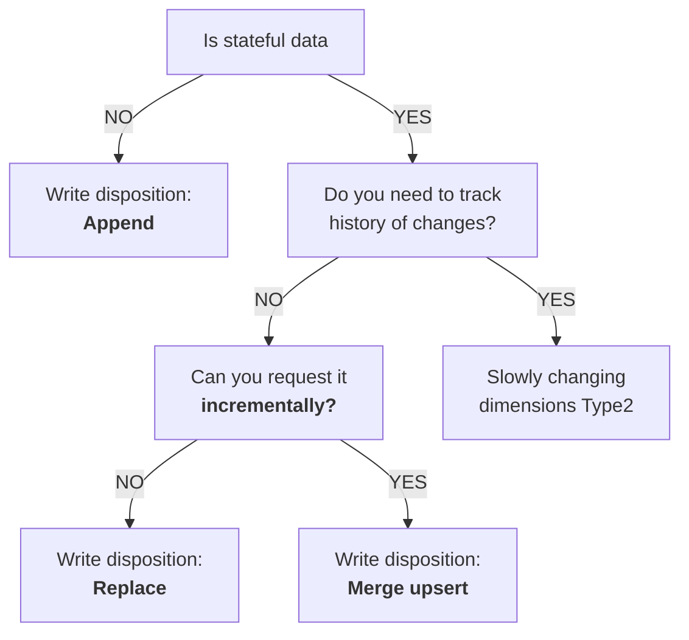

## Write dispositions

A **write disposition** in the context of the `dlt` library defines how data should be written to the destination. There are three types:

- **Append**: The **default** disposition. It appends new data to the existing data in the destination.
- **Replace**: This disposition replaces all existing data at the destination with the new data from the resource. It **deletes** all previous data and **recreates** the schema before loading.
- **Merge**: This disposition merges incoming data with existing data at the destination. For `merge`, you must specify a `primary_key` for the resource.



The "write disposition" you choose depends on the dataset and how you can extract it. To find the "write disposition" you should use, the first question you should ask yourself is "Is my data stateful or stateless"? Stateful data has a state that is subject to change - for example, a user's profile. Stateless data cannot change - for example, a recorded event, such as a page view.

Because **stateless** data does not need to be updated, we can just append it. For **stateful** data, comes a second question - Do you need to track history of change ? If yes, you should use [slowly changing dimensions (Type-2)](https://dlthub.com/docs/general-usage/merge-loading#scd2-strategy), which allow you to maintain historical records of data changes over time. If not, then we need to replace the entire dataset. However, if we can request the data incrementally, such as "all users added or modified since yesterday," then we can simply apply changes to our existing dataset with the merge write disposition.

You can specify a `write_disposition` in the resource decorator.

```python
@dlt.resource(write_disposition="append")
def my_resource():
	...
	yield data
```

Or directly in the pipeline run:

```python
load_info = pipeline.run(my_resource, write_disposition="replace")
```

If both are specified, the write disposition at the pipeline run level overrides the one set at the resource level.

The **merge** write disposition can be useful in several situations:

1. If you have a dataset where records are frequently updated and you want to reflect these changes in your database, the `merge` write disposition can be used. It will **update the existing records** with the new data instead of creating duplicate entries.
2. If your data source occasionally sends **duplicate records**, the merge write disposition can help handle this. It uses a `primary_key` to identify unique records, so if a duplicate record (with the same `primary_key`) is encountered, it will be merged with the existing record instead of creating a new one.
3. If you are dealing with **Slowly Changing Dimensions** (SCD) where the attribute of a record changes over time and you want to maintain a history of these changes, you can use the `merge` write disposition with the scd2 strategy.

## Merge Strategies
When using the merge disposition, you need to specify a `primary_key` or `merge_key` for the resource. The merge write disposition can be used with three different **strategies**:

- delete-insert (default strategy)
- scd2
- upsert

Both primary keys and merge keys are defined as NOT NULLABLE. This behavior may change based on the destination database.

```python
@dlt.resource(
    write_disposition={"disposition": "merge", "strategy": "scd2"}
)
def dim_customer():
    # initial load
    yield [
        {"customer_key": 1, "c1": "foo", "c2": 1},
        {"customer_key": 2, "c1": "bar", "c2": 2}
    ]

pipeline.run(dim_customer())  # first run — 2024-04-09 18:27:53.734235
...
```

### delete-insert

1. The `delete-insert` strategy loads data to a `staging` dataset, **deduplicates** the staging data if a **`primary_key`** is provided.
2. Then, it deletes the data from the destination using `merge_key` and `primary_key`.
3. Finally, it inserts the new records.

All of this occurs within a single atomic transaction for the root and all nested tables.

By default, `primary_key` deduplication is arbitrary. You can pass the `dedup_sort` column hint with a value of `desc` or `asc` to control which record remains after deduplication. With `desc`, records sharing the same `primary_key` are sorted in descending order before deduplication, ensuring that the record with the highest value for the column with the `dedup_sort` hint remains. The `asc` option applies the opposite behavior.

```python
@dlt.resource(
	primary_key="id",
	write_disposition="merge",
	columns={"created_at": {"dedup_sort": "desc"}}
)
def resource():
	...
```

If staging data is already deduplicated (or was always clean) you can disable it. Deduplication is performed by the database backend so you may save some costs:

```python
@dlt.resource(
	primary_key="id",
	write_disposition={
		"disposition": "merge",
		"strategy": "delete-insert",
		"deduplicated": True
	}
)
def github_repo_events():
	yield from _get_event_pages()
```

The `hard_delete` column hint can be used to delete records from the destination dataset. The behavior of the delete mechanism depends on the data type of the column marked with the hint:

1. `bool` type: only `True` leads to a delete—`None` and `False` values are disregarded.
2. Other types: each `not None` value leads to a delete.

If the incoming data contains a record marked as deleted, then any existing record in the destination table with the same `primary_key` or `merge_key` **will be removed**. Deletes are propagated to any nested table that might exist. For each record that gets deleted in the root table, all corresponding records in the nested table(s) will also be deleted.

```python
@dlt.resource(
    primary_key="id",
    write_disposition="merge",
    columns={"deleted_flag": {"hard_delete": True}}
)
def resource():
    # This will insert a record (assuming a record with id = 1 does not yet exist).
    yield {"id": 1, "val": "foo", "deleted_flag": False}
    # This will update the record.
    yield {"id": 1, "val": "bar", "deleted_flag": None}
    # This will delete the record.
    yield {"id": 1, "val": "foo", "deleted_flag": True}
    # Similarly, this would have also deleted the record.
    # Only the key and the column marked with the "hard_delete" hint suffice to delete records.
    yield {"id": 1, "deleted_flag": True}
...
```

### scd2

`dlt` can create [Slowly Changing Dimension Type 2](https://en.wikipedia.org/wiki/Slowly_changing_dimension#Type_2:_add_new_row) (SCD2) destination tables for dimension tables that change in the source. By default, the resource is expected to provide a full extract of the source table each run, though [incremental extracts](https://dlthub.com/docs/general-usage/merge-loading#example-incremental-scd2) are also possible. A row hash is stored in `_dlt_id` and used as a surrogate key to identify source records that have been inserted, updated, or deleted. A `NULL` value is used by default to indicate an active record, but a configurable high timestamp (for example, 9999-12-31 00:00:00.000000) can be used instead.

By default, `dlt` generates a row hash based on all columns provided by the resource and stores it in `_dlt_id`. You can use your own hash instead by specifying `row_version_column_name` in the `write_disposition` dictionary. You might already have a column present in your resource that can naturally serve as a row hash, in which case it's more efficient to use those pre-existing hash values than to generate new artificial ones. This option also allows you to use hashes based on a subset of columns, in case you want to ignore changes in some of the columns. When using your own hash, values for `_dlt_id` are randomly generated.

```python
@dlt.resource(
    write_disposition={
        "disposition": "merge",
        "strategy": "scd2",
        "row_version_column_name": "row_hash",
        # the column "row_hash" should be provided by the resource
    }
)
def dim_customer():
    ...
...
```

If your source data contains nested fields (like lists or arrays) that may return in different order across API calls, the automatically generated row hash will differ even when the actual data hasn't changed. Using `row_version_column_name` to provide your own hash based on stable fields is a good solution for this.
### upsert
The `upsert` merge strategy does primary-key based _upserts_:

- _update_ a record if the key exists in the target table
- _insert_ a record if the key does not exist in the target table

You can [delete records](https://dlthub.com/docs/general-usage/merge-loading#delete-records) with the `hard_delete` hint.

Unlike the default `delete-insert` merge strategy, the `upsert` strategy:

1. needs a `primary_key`
2. expects this `primary_key` to be unique (`dlt` does not deduplicate)
3. does not support `merge_key`
4. uses `MERGE` or `UPDATE` operations to process updates

### insert-only
The `insert-only` merge strategy is supported for all destinations that support `upsert` (see [above](https://dlthub.com/docs/general-usage/merge-loading#upsert-strategy)), including `filesystem` with `delta` and `iceberg` table formats and `lancedb`.

The `insert-only` merge strategy does primary-key based _inserts_ without updating existing records:

- _insert_ a record if the key does not exist in the target table
- _skip_ a record if the key already exists in the target table (no update happens)

This strategy is ideal for append-only data (events, logs, transactions) where existing records should never be modified. Re-running a pipeline only adds missing records, providing idempotent loads with better performance than `upsert` by skipping `UPDATE` operations entirely.

You can use the `hard_delete` hint to filter out records marked for deletion before insertion. Unlike `upsert`, existing records in the target are never deleted — the hint only prevents new deleted records from being inserted.

## Full or Partial Refresh
You may force a refresh of `merge` and `append` resources by setting the `refresh` option on the `dlt.pipeline` constructor or in the `run` method:

- `drop_data` truncates all tables belonging to the selected resources and resets their state (including incremental). The schema is not changed.
- `drop_resources` drops all tables belonging to the selected resources, from both the schema and the destination, and wipes their state. The tables are recreated with new data, and the stored schema history is erased (only the latest version is kept).
- `drop_sources` drops all tables belonging to the sources being loaded and fully resets their schema and state.

Table truncation/drop happens when the load step starts, so a failed extract or normalization does not affect destination data.

Example:

```python
import dlt
pipeline = dlt.pipeline("airtable_demo", destination="duckdb")
pipeline.run(
	sql_database().with_resources("users"),
	refresh="drop_data"
)
```

Above, we refresh the `users` table (a partial refresh) by truncating it, loading data from scratch, and leaving the other tables intact.

The `refresh` option is part of the pipeline configuration and may be set without changing the code. Setting this env variable sets the refresh option for a single pipeline script execution.

```md
PIPELINES__GITHUB_PIPELINE__REFRESH=drop_data python github_pipeline.py
```

