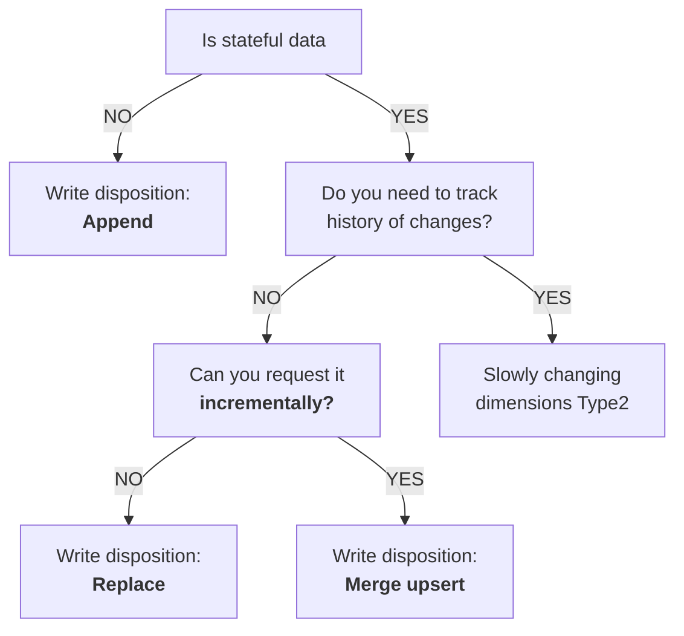

[Homepage](https://dlthub.learnworlds.com/courses)
[[Library - dlt]]
# dlt Fundamentals

## Quickstart
**What is a `dlt` Pipeline?**

A [pipeline](https://www.google.com/url?q=https%3A%2F%2Fdlthub.com%2Fdocs%2Fgeneral-usage%2Fpipeline) is a connection that moves data from your Python code to a destination. The pipeline accepts dlt sources or resources, as well as generators, async generators, lists, and any iterables. Once the pipeline runs, all resources are evaluated and the data is loaded at the destination.

```python
another_pipeline = dlt.pipeline(
    pipeline_name="resource_source",
    destination="duckdb",
    dataset_name="mydata",
    dev_mode=True,
)
```

You instantiate a pipeline by calling the `dlt.pipeline` function with the following arguments:

- **`pipeline_name`**: This is the name you give to your pipeline. It helps you track and monitor your pipeline, and also helps to bring back its state and data structures for future runs. If you don't provide a name, dlt will use the name of the Python file you're running as the pipeline name.
- **`destination`**: a name of the destination to which dlt will load the data. It may also be provided to the run method of the pipeline.
- **`dataset_name`**: This is the name of the group of tables (or dataset) where your data will be sent. You can think of a dataset like a folder that holds many files, or a schema in a relational database. You can also specify this later when you run or load the pipeline. If you don't provide a name, it will default to the name of your pipeline.
- **`dev_mode`**: If you set this to True, dlt will add a timestamp to your dataset name every time you create a pipeline. This means a new dataset will be created each time you create a pipeline.

To load the data, you call the `run()` method and pass your data in the data argument.

```python
# Run the pipeline and print load info
load_info = another_pipeline.run(data, table_name="pokemon")
print(load_info)
```

Commonly used arguments:

- **`data`** (the first argument) may be a dlt source, resource, generator function, or any Iterator or Iterable (i.e., a list or the result of the map function).
- **`write_disposition`** controls how to write data to a table. Defaults to the value "append".
    - `append` will always add new data at the end of the table.
    - `replace` will replace existing data with new data.
    - `skip` will prevent data from loading.
    - `merge` will deduplicate and merge data based on `primary_key` and `merge_key` hints.
- **`table_name`**: specified in cases when the table name cannot be inferred, i.e., from the resources or name of the generator function.

**`dlt`'s sql_client**

Most dlt destinations (even filesystem) use an implementation of the `SqlClientBase` class to connect to the physical destination to which your data is loaded. You can access the SQL client of your destination via the `sql_client` method on your pipeline.

Start a connection to your database with `pipeline.sql_client()` and execute a query to get all data from the `pokemon` table:

```python
# Query data from 'pokemon' using the SQL client
with another_pipeline.sql_client() as client:
    with client.execute_query("SELECT * FROM pokemon") as cursor:
        data = cursor.df()
data
```

**dlt datasets**

Here's an example of how to retrieve data from a pipeline and load it into a Pandas DataFrame or a PyArrow Table.

```python
dataset = another_pipeline.dataset()
dataset.pokemon.df()
```

**DuckDB Connection**
Start a connection to your database using a native `duckdb` connection and see which tables were generated:

```python
import duckdb

with duckdb.connect(f"{pipeline.pipeline_name}.duckdb") as conn:
    conn.sql(f"SELECT * FROM {pipeline.dataset_name}.<table_name>").pl() # fetch_arrow_table(), show()
```
## Resources and Sources
A better way to represent the *pokemon* table is to wrap it in the `@dlt.resource` decorator which denotes a logical grouping of data within a data source, typically holding data of similar structure and origin:

```python
import dlt
from dlt.common.typing import TDataItems, TDataItem

pipeline = dlt.pipeline(
    pipeline_name="resource_source",
    destination="duckdb",
    dataset_name="mydata",
    dev_mode=True,
)

data = [
    {"id": "1", "name": "bulbasaur", "size": {"weight": 6.9, "height": 0.7}},
    {"id": "4", "name": "charmander", "size": {"weight": 8.5, "height": 0.6}},
    {"id": "25", "name": "pikachu", "size": {"weight": 6, "height": 0.4}},
]

# Create a dlt resource from the data
@dlt.resource(table_name="pokemon_new")
def my_dict_list() -> TDataItems:
    yield data

# Define a resource to load data from a CSV
@dlt.resource(table_name="df_data")
def my_df() -> TDataItems:
    sample_df = pd.read_csv(
	    "https://people.sc.fsu.edu/~jburkardt/data/csv/hw_200.csv"
    )
    yield sample_df

# Define a resource to fetch genome data from the database
@dlt.resource(table_name="genome_data")
def get_genome_data() -> TDataItems:
	from sqlalchemy import create_engine
    engine = create_engine(
        "mysql+pymysql://rfamro@mysql-rfam-public.ebi.ac.uk:4497/Rfam"
    )
    with engine.connect() as conn:
        query = "SELECT * FROM genome LIMIT 1000"
        rows = conn.execution_options(yield_per=100).exec_driver_sql(query)
        yield from map(lambda row: dict(row._mapping), rows)

# Define a resource to fetch pokemons from PokeAPI
@dlt.resource(table_name="pokemon_api")
def get_pokemon() -> TDataItems:
	from dlt.sources.helpers import requests
    url = "https://pokeapi.co/api/v2/pokemon"
    response = requests.get(url)
    yield response.json()["results"]


# Run the pipeline and print load info
pipeline.run(my_dict_list)
pipeline.run(my_df)
pipeline.run(get_genome_data)
```

Commonly used arguments:

- **`name`**: The resource name and the name of the table generated by this resource. Defaults to the decorated function name.
- **`table_name`**: The name of the table, if different from the resource name.
- **`write_disposition`**: Controls how to write data to a table. Defaults to the value "append".

Instead of a dict list, the data could also be a/an:

- dataframe
- database query response
- API request response
- Anything you can transform into JSON/dict format

**Why is it a better way?** This allows you to use `dlt` functionalities to the fullest that follow Data Engineering best practices, including incremental loading and data contracts.

### **`dlt` sources**

Now that there are multiple `dlt` resources, each corresponding to a separate table, we can group them into a **`dlt` source**. A source is a logical grouping of resources, e.g., endpoints of a single API. The most common approach is to define it in a separate Python module. Read more about [sources](https://www.google.com/url?q=https%3A%2F%2Fdlthub.com%2Fdocs%2Fgeneral-usage%2Fsource) and [resources](https://www.google.com/url?q=https%3A%2F%2Fdlthub.com%2Fdocs%2Fgeneral-usage%2Fresource).

- A source is a function decorated with `@dlt.source` that returns one or more resources.
- A source can optionally define a schema with tables, columns, performance hints, and more.
- The source Python module typically contains optional customizations and data transformations.
- The source Python module typically contains the authentication and pagination code for a particular API.

You declare a source by decorating a function that returns or yields one or more resources with `@dlt.source`. Only using the source above, load everything into a separate database using a new pipeline:

```python
from typing import Iterable
from dlt.extract import DltResource
  

@dlt.source
def all_data() -> Iterable[DltResource]:
    return my_df, get_genome_data, get_pokemon

# Create a pipeline

new_pipeline = dlt.pipeline(
    pipeline_name="resource_source_new",
    destination="duckdb",
    dataset_name="all_data"
)

# Run the pipeline
load_info = new_pipeline.run(all_data())
print(load_info)

# Using dataset API
data = pipeline.dataset().table("dlt_hub_repos").arrow()

# Using sql_client API
with pipeline.sql_client() as sql_client:
    with sql_client.execute_query(
	    f"SELECT * FROM {pipeline.dataset_name}.dlt_hub_repos"
	) as cursor:
        data = cursor.arrow()

# Using Database connection
import duckdb

with duckdb.connect(f"{pipeline.pipeline_name}.duckdb") as conn:
    conn.sql(f"SELECT * FROM {pipeline.dataset_name}.<table_name>").pl() # fetch_arrow_table(), show()
```

- Pipeline name (`resource_source_new`): Identifies the pipeline and, for DuckDB, determines the database filename or catalog.
- Destination (`duckdb`): Specifies DuckDB as the destination where the extracted data will be stored.
- Dataset name (`all_data`): Specifies the schema in DuckDB where the tables will be created. If omitted, DLT defaults to `<pipeline_name>_dataset`.
- Resource name: Determines the table name within the dataset. For example, a resource named `family` will generally be loaded into the `family` table.

**Why does this matter?**:

- It is more efficient than running your resources separately.
- It organizes both your schema and your code.
- It enables the option for parallelization.

### **`dlt` transformers**

We now know that `dlt` resources can be grouped into a `dlt` source, represented as:

```
                  Source
               /          \
          Resource 1  ...  Resource N
```

However, imagine a scenario where you need an additional step in between, for example, in a situation where Resource 1 returns a list of pokemons IDs, and you need to use each of those IDs to retrieve detailed information about the pokemons from a separate API endpoint. In such cases, you would use `dlt` transformers — special `dlt` resources that can be fed data from another resource:

```

                  Source
                 /     \
          Transformer    \
             /             \
        Resource 1  ...  Resource N
```

Given the *pokemon* resource, we need to get detailed information about pokemons from [PokeAPI](https://www.google.com/url?q=https%3A%2F%2Fpokeapi.co%2F) `"https://pokeapi.co/api/v2/pokemon/{id}"` based on their IDs.

```python
# Pattern #1: Transformer receives all items at once
@dlt.resource(table_name="pokemon")
def my_pokemons() -> TDataItems:
    pokemons = [
        {"id": "1", "name": "bulbasaur", "size": {"weight": 6.9, "height": 0.7}},
        {"id": "4", "name": "charmander", "size": {"weight": 8.5, "height": 0.6}},
        {"id": "25", "name": "pikachu", "size": {"weight": 6, "height": 0.4}},
    ]
    yield pokemons

# Define a transformer to enrich pokemon data with additional details
@dlt.transformer(data_from=my_pokemons, table_name="detailed_info")
	def poke_details(
    items: TDataItems,
) -> TDataItems:
    for item in items:
        print(f"Item: {item}\n")
        item_id = item["id"]
        url = f"https://pokeapi.co/api/v2/pokemon/{item_id}"
        response = requests.get(url)
        details = response.json()
        print(f"Details: {details}\n")
        yield details

# ===

# Pattern #2: Transformer receives one item at a time
@dlt.resource(table_name="pokemon")
def my_other_pokemons() -> TDataItems:
    pokemons = [
        {"id": "1", "name": "bulbasaur", "size": {"weight": 6.9, "height": 0.7}},
        {"id": "4", "name": "charmander", "size": {"weight": 8.5, "height": 0.6}},
        {"id": "25", "name": "pikachu", "size": {"weight": 6, "height": 0.4}},
    ]

    yield from pokemons

@dlt.transformer(data_from=my_other_pokemons, table_name="detailed_info")
def other_poke_details(
    data_item: TDataItem,
) -> TDataItems:
    item_id = data_item["id"]
    url = f"https://pokeapi.co/api/v2/pokemon/{item_id}"
    response = requests.get(url)
    details = response.json()
    yield details

# Set pipeline name, destination, and dataset name

pipeline = dlt.pipeline(
    pipeline_name="quick_start",
    destination="duckdb",
    dataset_name="pokedata",
    dev_mode=True,
)

# Run the pipeline
load_info = pipeline.run(poke_details())
print(load_info)
```

You can also use pipe instead of `data_from`, this is useful when you want to apply `dlt.transformer` to multiple `dlt.resources`:

```python
load_info = another_pipeline.run(my_pokemons | poke_details)
print(load_info)
```

### Nesting levels

You can limit how deep dlt goes when generating nested tables and flattening dicts into columns. By default, the library will descend and generate nested tables for all nested lists, without limit. You can set nesting level for all resources on the source level or for each resource separately:

```python
@dlt.source(max_table_nesting=1)
def all_data():
	return my_df, get_genome_data, get_pokemon

@dlt.resource(table_name='pokemon_new', max_table_nesting=1)
def my_dict_list():
	yield data
```

In the example above, we want only 1 level of nested tables to be generated (so there are no nested tables of a nested table). Typical settings:

- `max_table_nesting=0` will not generate nested tables and will not flatten dicts into columns at all. All nested data will be represented as JSON.
- `max_table_nesting=1` will generate nested tables of root tables and nothing more. All nested data in nested tables will be represented as JSON.

## Pagination and Authentication

When working with APIs, you could implement pagination using only Python and the `requests` library. While this approach works, it often requires writing boilerplate code for tasks like managing authentication, constructing URLs, and handling pagination logic. **But!** We’re going to use dlt's **[RESTClient](https://www.google.com/url?q=https%3A%2F%2Fdlthub.com%2Fdocs%2Fgeneral-usage%2Fhttp%2Frest-client)** to handle pagination seamlessly when working with REST APIs like GitHub.

**Why use RESTClient?**

RESTClient is part of dlt's helpers, making it easier to interact with REST APIs by managing repetitive tasks such as:

- Authentication
- Query parameter handling
- Pagination

This reduces boilerplate code and lets you focus on your data pipeline logic. 

1. Import `RESTClient`
2. Create a `RESTClient` instance
3. Use the `paginate` method to iterate through all pages of data

```python
from dlt.sources.helpers.rest_client import RESTClient
from dlt.sources.helpers.rest_client.paginators import HeaderLinkPaginator

# Pattern #1: Let DLT figure it out
client = RESTClient(
    base_url="https://api.github.com",
)
  
# Pattern #2: Specify paginator
client = RESTClient(
    base_url="https://api.github.com",
    paginator=HeaderLinkPaginator(),
)

for page in client.paginate("orgs/dlt-hub/events"):
    print(page)
```

The events endpoint doesn’t contain as much data, especially compared to the issue comments endpoint of the dlt repository. If you run the pipeline for the issue comments endpoint, there's a high chance that you'll face a **rate limit error**.

To avoid the **rate limit error** you can use [GitHub API Authentication](https://www.google.com/url?q=https%3A%2F%2Fdocs.github.com%2Fen%2Frest%2Fauthentication%2Fauthenticating-to-the-rest-api%3FapiVersion%3D2022-11-28):

1. Login to your GitHub account.
2. Generate an [API token](https://www.google.com/url?q=https%3A%2F%2Fdocs.github.com%2Fen%2Fauthentication%2Fkeeping-your-account-and-data-secure%2Fcreating-a-personal-access-token) (classic).
3. Use it as an access token for the GitHub API.

```python
from dlt.sources.helpers.rest_client.auth import BearerTokenAuth

client = RESTClient(
    base_url="https://api.github.com",
    auth=BearerTokenAuth(token=access_token),
)

for page in client.paginate("repos/dlt-hub/dlt/issues/comments"):
    print(page)
    break
```

### dlt configuration and secrets

In dlt, [configurations and secrets](https://www.google.com/url?q=https%3A%2F%2Fdlthub.com%2Fdocs%2Fgeneral-usage%2Fcredentials%2F) are essential for setting up data pipelines. **Configurations** are **non-sensitive** settings that define the behavior of a data pipeline, including file paths, database hosts, timeouts, API URLs, and performance settings. On the other hand, **secrets** are **sensitive** data like passwords, API keys, and private keys, which should never be hard-coded to avoid security risks. Both can be set up in various ways:

- As environment variables
- Within code using `dlt.secrets` and `dlt.config`
- Via configuration files (`secrets.toml` and `config.toml`)

To define the `access_token` secret value, we can use

1. `dlt.secrets` in code (recommended for secret vaults or dynamic creds)
2. Environment variables (recommended for prod)
3. `secrets.toml` file (recommended for local dev)

#### **Use `dlt.secrets` in code**

You can easily set or update your secrets directly in Python code. This is especially convenient when retrieving credentials from third-party secret managers or when you need to update secrets and configurations dynamically.

```python
from google.colab import userdata

dlt.secrets["access_token"] = userdata.get("SECRET_KEY")
dlt.secrets["sources.access_token"] = userdata.get('SECRET_KEY')
dlt.secrets["sources.____main____.access_token"] = userdata.get('SECRET_KEY')
dlt.secrets["sources.____main____.github_source.access_token"] = userdata.get('SECRET_KEY')
```

- `sources` is a special word;
- `__main__` is a python module name;
- `github_source` is the resource name;
- `access_token` is the secret variable name.

To keep the **naming convention** flexible, dlt looks for a lot of **possible combinations** of key names, starting from the most specific possible path. Then, if the value is not found, it removes the right-most section and tries again, according to this hierarchy:

```md
pipeline_name
    |
    |-sources
        |
        |-<module name>
            |  
            |-<source function 1 name>
                |
                |- secret variable 1
                |- secret variable 2
```

#### Configuration and secrets files
This example uses the [Notion](https://dlthub.com/docs/dlt-ecosystem/verified-sources/notion) source and [filesystem](https://dlthub.com/docs/dlt-ecosystem/destinations/filesystem) destination to demonstrate how to organize configuration in TOML files using the [recommended section layout](https://dlthub.com/docs/general-usage/credentials/setup#recommended-section-layout).

The Notion source is defined in a file named `notion.py`, so we use that module name in the configuration. We configure the `api_key` in our configuration while passing the list of database IDs explicitly in code. For the filesystem destination, we split configuration between `config.toml` (for `bucket_url`) and `secrets.toml` (for AWS credentials).

```python
import dlt

@dlt.source
def notion_databases(
	database_ids = None,
	api_key: str = dlt.secrets.value,  # mark argument to be injected as secret
):
	...
	# Pass database_id in code, let `dlt` inject api_key
	sales_database = notion_databases(  # type: ignore
		database_ids=[{
			"id": "a94223535c674d33a24e313e7921ce15",
			"use_name": "sales_alias"
			}])
```

**config.toml**
```toml
[runtime]
log_level="INFO"

# Do not compress files sent to the filesystem bucket
[normalize.data_writer]
disable_compression=true

# Recommended sections for the destination (destination.module)
[destination.filesystem]
bucket_url = "s3://[your_bucket_name]"
```

**secrets.toml**

```toml
# Recommended sections for sources (sources.module)
[sources.notion]
api_key = "your-notion-api-key"  # Will be injected to api_key argument

# Recommended sections for destination credentials
[destination.filesystem.credentials]
aws_access_key_id = "ABCDEFGHIJKLMNOPQRST" 
aws_secret_access_key = "1234567890_access_key" 
```

While `dlt` handles credentials automatically, you can also access them directly in your code. The `dlt.secrets` and `dlt.config` objects provide dictionary-like access to configuration values and secrets, enabling custom preprocessing if required. You can also store custom settings in the same configuration files.

```python
# Use `dlt.secrets` and `dlt.config` to explicitly retrieve values from providers
source_instance = google_sheets(
	dlt.config["sheet_id"],
	dlt.config["my_section.tabs"],
	dlt.secrets["my_section.gcp_credentials"]
)
source_instance.run(destination="bigquery")
```

`dlt.config` and `dlt.secrets` function as dictionaries. `dlt` examines all [config providers](https://dlthub.com/docs/general-usage/credentials/setup) - environment variables, TOML files, etc. - to populate these dictionaries. You can also use `dlt.config.get()` or `dlt.secrets.get()` to retrieve a value and convert it to a specific type:

```python
credentials = dlt.secrets.get(
	"my_section.gcp_credentials",
	GcpServiceAccountCredentials
)
```

This creates a `GcpServiceAccountCredentials` instance from the values stored under the `my_section.gcp_credentials` key.

#### Environment variables

dlt uses a specific naming hierarchy to search for the secrets and config values. This makes configurations and secrets easy to manage. The naming convention for **environment variables** in dlt follows a specific pattern. All names are **capitalized** and sections are separated with **double underscores** __ , e.g. `SOURCES____MAIN____GITHUB_SOURCE__SECRET_KEY`.

## dlt pre-built Sources and Destinations

The main difference between the [core sources](https://dlthub.com/docs/dlt-ecosystem/verified-sources#core-sources) and [verified sources](https://dlthub.com/docs/dlt-ecosystem/verified-sources#verified-sources) lies in their structure. Core sources are generic collections, meaning they can connect to a variety of systems. For example, the [SQL Database source](https://dlthub.com/docs/dlt-ecosystem/verified-sources/sql_database) can connect to any database that supports SQLAlchemy.

It's also important to note that core sources are integrated into the `dlt` core library, whereas verified sources are maintained in a separate [repository](https://github.com/dlt-hub/verified-sources). To use a verified source, you need to run the `dlt init` command, which will download the verified source code to your working directory. Available dlt core sources:

- **filesystem**: Reads files in s3, gs or azure buckets using fsspec and provides convenience resources for chunked reading of various file formats
- **rest_api**: Generic API Source
- **sql_database**: Source that loads tables form any SQLAlchemy supported database, supports batching requests and incremental loads.

This command shows all available verified sources and their short descriptions. For each source, it checks if your local `dlt` version requires an update and prints the relevant warning.

```sh
dlt init --list-sources;
dlt init --list-destinations;
```

This command will initialize the pipeline example with the GitHub API as the source and DuckDB as the destination:

```sh
dlt init github_api duckdb
```

What you would normally do with the project:

- Add your credentials and define configurations
- Adjust the pipeline script as needed
- Run the pipeline script

### RestAPI Sources

`rest_api` is a generic source that lets you create a `dlt` source from any REST API using a declarative configuration. Since most REST APIs follow similar patterns, this source provides a convenient way to define your integration declaratively.

Using a [declarative configuration](https://www.google.com/url?q=https%3A%2F%2Fdlthub.com%2Fdocs%2Fdlt-ecosystem%2Fverified-sources%2Frest_api%2Fbasic%23source-configuration), you can specify:

- the API endpoints to pull data from,
- their relationships,
- how to handle pagination,
- authentication.

`dlt` handles the rest for you: **unnesting the data, inferring the schema**, and **writing it to the destination**.

In the previous lesson, you already used the REST API Client. `dlt`’s **[RESTClient](https://www.google.com/url?q=https%3A%2F%2Fdlthub.com%2Fdocs%2Fgeneral-usage%2Fhttp%2Frest-client)** is the **low-level abstraction** that powers the RestAPI source.

```python
@dlt.source(name="github")
def github_source(access_token: Optional[str] = dlt.secrets.value) -> Any:
    # Create a REST API configuration for the GitHub API
    # Use RESTAPIConfig to get autocompletion and type checking
    print("Token configured:", bool(access_token))
    print("Token prefix:", access_token[:4] + "..." if access_token else None)

    config: RESTAPIConfig = {
        "client": {
            "base_url": "https://api.github.com/repos/dlt-hub/dlt/",
            "paginator": {
                "type": "json_link",
                "next_url_path": "paging.next",
            },
            # we add an auth config if the auth token is present
            "auth": (
                {
                    "type": "bearer",
                    "token": access_token,
                }
                if access_token
                else None
            ),
        },
        # The default configuration for all resources and their endpoints
        "resource_defaults": {
            "primary_key": "id",
            "write_disposition": "merge",
            "endpoint": {
                "params": {
                    "per_page": 100,
                },
            },
        },
        "resources": [
            # This is a simple resource definition,
            # that uses the endpoint path as a resource name:
            # "pulls",
            # Alternatively, you can define the endpoint as a dictionary
            # {
            #     "name": "pulls", # <- Name of the resource
            #     "endpoint": "pulls",  # <- This is the endpoint path
            # }
            # Or use a more detailed configuration:
            {
                "name": "issues",
                "endpoint": {
                    "path": "issues",
                    "response_actions": [rate_limit],
                    # Query parameters for the endpoint
                    "params": {
                        "sort": "updated",
                        "direction": "desc",
                        "state": "open",
                        # Define `since` as a special parameter
                        # to incrementally load data from the API.
                        # This works by getting the updated_at value
                        # from the previous response data and using this value
                        # for the `since` query parameter in the next request.
                        "since": "{incremental.start_value}",
                    },
                    # For incremental to work, we need to define the cursor_path
                    # (the field that will be used to get the incremental value)
                    # and the initial value
                    "incremental": {
                        "cursor_path": "updated_at",
                        "initial_value": pendulum.today().subtract(days=30).to_iso8601_string(),
                    },
                },
            },
            # The following is an example of a resource that uses
            # a parent resource (`issues`) to get the `issue_number`
            # and include it in the endpoint path:
            {
                "name": "issue_comments",
                "endpoint": {
                    # The placeholder `{resources.issues.number}`
                    # will be replaced with the value of `number` field
                    # in the `issues` resource data
                    "path": "issues/{resources.issues.number}/comments",
                    "response_actions": [rate_limit],
                },
                # Include data from `id` field of the parent resource
                # in the child data. The field name in the child data
                # will be called `_issues_id` (_{resource_name}_{field_name})
                "include_from_parent": ["id"],
            },
            {
                "name": "contributors",
                "endpoint": {
                    # The placeholder `{resources.issues.number}`
                    # will be replaced with the value of `number` field
                    # in the `issues` resource data
                    "path": "contributors",
                    "response_actions": [rate_limit],
                },
            },
        ],
    }

    yield from rest_api_resources(config)
```

### SQL Database Source

SQL databases are management systems (DBMS) that store data in a structured format, commonly used for efficient and reliable data retrieval.

The `sql_database` verified source loads data to your specified destination using one of the following backends:

- SQLAlchemy,
- PyArrow,
- pandas,
- ConnectorX.

Before running the pipeline, make sure to install all the necessary dependencies:

1. **General dependencies**: These are the general dependencies needed by the `sql_database` source.
2. **Database-specific dependencies**: In addition to the general dependencies, you will also need to install `pymysql` to connect to the MySQL database in this tutorial.

```
pip install pymysql
```
  
Explanation: dlt uses SQLAlchemy to connect to the source database and hence, also requires the database-specific SQLAlchemy dialect, such as `pymysql` (MySQL), `psycopg2` (Postgres), `pymssql` (MSSQL), `snowflake-sqlalchemy` (Snowflake), etc. See the [SQLAlchemy docs](https://docs.sqlalchemy.org/en/20/dialects/#external-dialects) for a full list of available dialects.

```python
from dlt.sources.sql_database import sql_database

sql_source = sql_database(
    "mysql+pymysql://rfamro@mysql-rfam-public.ebi.ac.uk:4497/Rfam",
    table_names=[
        "family",
    ],
)

sql_db_pipeline = dlt.pipeline(
    pipeline_name="sql_database_example",
    destination="duckdb",
    dataset_name="sql_data",
    dev_mode=True,
)

load_info = sql_db_pipeline.run(sql_source)
print(load_info)
```

To successfully connect to your SQL database, you will need to pass credentials into your pipeline. dlt automatically looks for this information inside the generated TOML files. Simply paste the [connection details](https://docs.rfam.org/en/latest/database.html) inside `secrets.toml` as follows:

```toml
[sources.sql_database.credentials]
drivername = "mysql+pymysql" # database+dialect
database = "Rfam"
password = ""
username = "rfamro"
host = "mysql-rfam-public.ebi.ac.uk"
port = 4497
```

Alternatively, you can also paste the credentials as a connection string:

```toml
sources.sql_database.credentials="mysql+pymysql://rfamro@mysql-rfam-public.ebi.ac.uk:4497/Rfam"
```

Note that, when you pass a connection string to DLT that includes parameters such as the database, dialect, host, and port, DLT **may still attempt to retrieve any missing parameters** from your `secrets.toml` file to complete the connection configuration. Mixing these two configuration methods can **lead to unexpected behavior**, such as DLT supplying a password that was not included in the connection string, so we recommend using a single approach. Provide all connection details in the connection string or configure them entirely in `secrets.toml`. This way, you ensure predictable credential resolution.

### Filesystem Source

The filesystem source allows seamless loading of files from the following locations:

- AWS S3
- Google Cloud Storage
- Google Drive
- Azure Blob Storage
- remote filesystem (via SFTP)
- local filesystem

The filesystem source natively supports CSV, Parquet, and JSONL files and allows customization for loading any type of structured file. The Filesystem source doesn't just give you an easy way to load data from both remote and local files — it also comes with a powerful set of tools that let you customize the loading process to fit your specific needs. Filesystem source loads data in two steps:

1. It accesses the files in your remote or local file storage **without** actually **reading** the content yet. At this point, you can filter files by metadata or name. You can also set up incremental loading to load only new files.
2. The **transformer** **reads** the files' content and yields the records. At this step, you can filter out the actual data, enrich records with metadata from files, or perform incremental loading based on the file content.

### Destinations

Most likely, the destination where you want to load data is already a `dlt` integration that undergoes several hundred automated tests every day. If not, you can define a custom destination and still benefit from most `dlt`-specific features. Switching between destinations in `dlt` is incredibly straightforward. Simply modify the `destination` parameter in your pipeline configuration.

```python
data_pipeline = dlt.pipeline(
    pipeline_name="data_pipeline",
    destination="duckdb",
    dataset_name="data",
)
print(data_pipeline.destination.destination_type)

data_pipeline = dlt.pipeline(
    pipeline_name="data_pipeline",
    destination="bigquery",
    dataset_name="data",
)
print(data_pipeline.destination.destination_type)
```

## Write dispositions and Incremental loading

Incremental loading is the act of loading only new or changed data and not old records that we have already loaded. It enables low-latency and low-cost data transfer. The challenge of incremental pipelines is that if we do not keep track of the state of the load (i.e., which increments were loaded and which are to be loaded), we may encounter issues.

### Write dispositions
A **write disposition** in the context of the `dlt` library defines how data should be written to the destination. There are three types:

- **Append**: The **default** disposition. It appends new data to the existing data in the destination.
- **Replace**: This disposition replaces all existing data at the destination with the new data from the resource. It **deletes** all previous data and **recreates** the schema before loading.
- **Merge**: This disposition merges incoming data with existing data at the destination. For `merge`, you must specify a `primary_key` for the resource.



The "write disposition" you choose depends on the dataset and how you can extract it. To find the "write disposition" you should use, the first question you should ask yourself is "Is my data stateful or stateless"? Stateful data has a state that is subject to change - for example, a user's profile. Stateless data cannot change - for example, a recorded event, such as a page view.

Because **stateless** data does not need to be updated, we can just append it. For **stateful** data, comes a second question - Do you need to track history of change ? If yes, you should use [slowly changing dimensions (Type-2)](https://dlthub.com/docs/general-usage/merge-loading#scd2-strategy), which allow you to maintain historical records of data changes over time. If not, then we need to replace the entire dataset. However, if we can request the data incrementally, such as "all users added or modified since yesterday," then we can simply apply changes to our existing dataset with the merge write disposition.

You can specify a `write_disposition` in the resource decorator.

```python
@dlt.resource(write_disposition="append")
def my_resource():
	...
	yield data
```

Or directly in the pipeline run:

```python
load_info = pipeline.run(my_resource, write_disposition="replace")
```

If both are specified, the write disposition at the pipeline run level overrides the one set at the resource level.

The **merge** write disposition can be useful in several situations:

1. If you have a dataset where records are frequently updated and you want to reflect these changes in your database, the `merge` write disposition can be used. It will **update the existing records** with the new data instead of creating duplicate entries.
2. If your data source occasionally sends **duplicate records**, the merge write disposition can help handle this. It uses a `primary_key` to identify unique records, so if a duplicate record (with the same `primary_key`) is encountered, it will be merged with the existing record instead of creating a new one.
3. If you are dealing with **Slowly Changing Dimensions** (SCD) where the attribute of a record changes over time and you want to maintain a history of these changes, you can use the `merge` write disposition with the scd2 strategy.

### Merge Strategies
When using the merge disposition, you need to specify a `primary_key` or `merge_key` for the resource. The merge write disposition can be used with three different **strategies**:

- delete-insert (default strategy)
- scd2
- upsert

Both primary keys and merge keys are defined as NOT NULLABLE. This behavior may change based on the destination database.

```python
@dlt.resource(
    write_disposition={"disposition": "merge", "strategy": "scd2"}
)
def dim_customer():
    # initial load
    yield [
        {"customer_key": 1, "c1": "foo", "c2": 1},
        {"customer_key": 2, "c1": "bar", "c2": 2}
    ]

pipeline.run(dim_customer())  # first run — 2024-04-09 18:27:53.734235
...
```

#### delete-insert

1. The `delete-insert` strategy loads data to a `staging` dataset, **deduplicates** the staging data if a **`primary_key`** is provided.
2. Then, it deletes the data from the destination using `merge_key` and `primary_key`.
3. Finally, it inserts the new records.

All of this occurs within a single atomic transaction for the root and all nested tables.

By default, `primary_key` deduplication is arbitrary. You can pass the `dedup_sort` column hint with a value of `desc` or `asc` to control which record remains after deduplication. With `desc`, records sharing the same `primary_key` are sorted in descending order before deduplication, ensuring that the record with the highest value for the column with the `dedup_sort` hint remains. The `asc` option applies the opposite behavior.

```python
@dlt.resource(
	primary_key="id",
	write_disposition="merge",
	columns={"created_at": {"dedup_sort": "desc"}}
)
def resource():
	...
```

If staging data is already deduplicated (or was always clean) you can disable it. Deduplication is performed by the database backend so you may save some costs:

```python
@dlt.resource(
	primary_key="id",
	write_disposition={
		"disposition": "merge",
		"strategy": "delete-insert",
		"deduplicated": True
	}
)
def github_repo_events():
	yield from _get_event_pages()
```

The `hard_delete` column hint can be used to delete records from the destination dataset. The behavior of the delete mechanism depends on the data type of the column marked with the hint:

1. `bool` type: only `True` leads to a delete—`None` and `False` values are disregarded.
2. Other types: each `not None` value leads to a delete.

If the incoming data contains a record marked as deleted, then any existing record in the destination table with the same `primary_key` or `merge_key` **will be removed**. Deletes are propagated to any nested table that might exist. For each record that gets deleted in the root table, all corresponding records in the nested table(s) will also be deleted.

```python
@dlt.resource(
    primary_key="id",
    write_disposition="merge",
    columns={"deleted_flag": {"hard_delete": True}}
)
def resource():
    # This will insert a record (assuming a record with id = 1 does not yet exist).
    yield {"id": 1, "val": "foo", "deleted_flag": False}
    # This will update the record.
    yield {"id": 1, "val": "bar", "deleted_flag": None}
    # This will delete the record.
    yield {"id": 1, "val": "foo", "deleted_flag": True}
    # Similarly, this would have also deleted the record.
    # Only the key and the column marked with the "hard_delete" hint suffice to delete records.
    yield {"id": 1, "deleted_flag": True}
...
```

#### scd2

`dlt` can create [Slowly Changing Dimension Type 2](https://en.wikipedia.org/wiki/Slowly_changing_dimension#Type_2:_add_new_row) (SCD2) destination tables for dimension tables that change in the source. By default, the resource is expected to provide a full extract of the source table each run, though [incremental extracts](https://dlthub.com/docs/general-usage/merge-loading#example-incremental-scd2) are also possible. A row hash is stored in `_dlt_id` and used as a surrogate key to identify source records that have been inserted, updated, or deleted. A `NULL` value is used by default to indicate an active record, but a configurable high timestamp (for example, 9999-12-31 00:00:00.000000) can be used instead.

By default, `dlt` generates a row hash based on all columns provided by the resource and stores it in `_dlt_id`. You can use your own hash instead by specifying `row_version_column_name` in the `write_disposition` dictionary. You might already have a column present in your resource that can naturally serve as a row hash, in which case it's more efficient to use those pre-existing hash values than to generate new artificial ones. This option also allows you to use hashes based on a subset of columns, in case you want to ignore changes in some of the columns. When using your own hash, values for `_dlt_id` are randomly generated.

```python
@dlt.resource(
    write_disposition={
        "disposition": "merge",
        "strategy": "scd2",
        "row_version_column_name": "row_hash",
        # the column "row_hash" should be provided by the resource
    }
)
def dim_customer():
    ...
...
```

If your source data contains nested fields (like lists or arrays) that may return in different order across API calls, the automatically generated row hash will differ even when the actual data hasn't changed. Using `row_version_column_name` to provide your own hash based on stable fields is a good solution for this.
#### upsert
The `upsert` merge strategy does primary-key based _upserts_:

- _update_ a record if the key exists in the target table
- _insert_ a record if the key does not exist in the target table

You can [delete records](https://dlthub.com/docs/general-usage/merge-loading#delete-records) with the `hard_delete` hint.

Unlike the default `delete-insert` merge strategy, the `upsert` strategy:

1. needs a `primary_key`
2. expects this `primary_key` to be unique (`dlt` does not deduplicate)
3. does not support `merge_key`
4. uses `MERGE` or `UPDATE` operations to process updates

#### insert-only
The `insert-only` merge strategy is supported for all destinations that support `upsert` (see [above](https://dlthub.com/docs/general-usage/merge-loading#upsert-strategy)), including `filesystem` with `delta` and `iceberg` table formats and `lancedb`.

The `insert-only` merge strategy does primary-key based _inserts_ without updating existing records:

- _insert_ a record if the key does not exist in the target table
- _skip_ a record if the key already exists in the target table (no update happens)

This strategy is ideal for append-only data (events, logs, transactions) where existing records should never be modified. Re-running a pipeline only adds missing records, providing idempotent loads with better performance than `upsert` by skipping `UPDATE` operations entirely.

You can use the `hard_delete` hint to filter out records marked for deletion before insertion. Unlike `upsert`, existing records in the target are never deleted — the hint only prevents new deleted records from being inserted.
### Cursor-based Incremental Loading
In most REST APIs (and other data sources, i.e., database tables), you can request new or updated data by passing a timestamp or ID of the "last" record to a query. The API/database returns just the new/updated records from which you take the maximum/minimum timestamp/ID for the next load.

To do incremental loading this way, we need to:

- Figure out which field is used to track changes (the so-called **cursor field**) (e.g., "inserted_at", "updated_at", etc.);
- Determine how to pass the "last" (maximum/minimum) value of the cursor field to an API to get just new or modified data (how we do this depends on the source API).

Once you've figured that out, `dlt` takes care of finding maximum/minimum cursor field values, removing duplicates, and managing the state with the last values of the cursor.

```python
data = [
    {
        "id": "1",
        "name": "bulbasaur",
        "size": {"weight": 6.9, "height": 0.7},
        "created_at": "2024-12-01",
    },
    {
        "id": "4",
        "name": "charmander",
        "size": {"weight": 8.5, "height": 0.6},
        "created_at": "2024-09-01",
    },
    {
        "id": "25",
        "name": "pikachu",
        "size": {"weight": 6, "height": 0.4},
        "created_at": "2023-06-01",
    },
]
cursor_date = dlt.sources.incremental("created_at", initial_value="2024-01-01")

@dlt.resource(
    name="pokemon",
    write_disposition={"disposition": "append"}, #, "strategy": "delete-insert"},
)
def append_pokemon(cursor_date=cursor_date):
	...
    yield data

@dlt.resource(primary_key="id")
def repo_issues(
    access_token=dlt.secrets.value,
    repository=dlt.config.value,
    updated_at = dlt.sources.incremental(
	    "updated_at", initial_value="1970-01-01T00:00:00Z")
):
    # Get issues since "updated_at" stored in state on previous run (or initial_value on first run)
    for page in _get_issues_page(
	    access_token,
	    repository,
	    since=updated_at.start_value
	):
        yield page
        # Last_value is updated after every page
        print(updated_at.last_value)
```

Here we add an `updated_at` argument that will receive incremental state, initialized to `1970-01-01T00:00:00Z`. It is configured to track the `updated_at` field in issues yielded by the `repo_issues` resource. It will store the newest `updated_at` value in `dlt` [state](https://dlthub.com/docs/general-usage/state) and make it available in `updated_at.start_value` on the next pipeline run. This value is inserted in the `_get_issues_page` function into the request query param **since** to the [GitHub API](https://docs.github.com/en/rest/issues/issues?#list-repository-issues).

In essence, the `dlt.sources.incremental` instance above:

- **updated_at.initial_value** which is always equal to "1970-01-01T00:00:00Z" passed in the constructor
- **updated_at.start_value** a maximum `updated_at` value from the previous run or the **initial_value** on the first run
- **updated_at.last_value** a "real-time" `updated_at` value updated with each yielded item or page. Before the first yield, it equals **start_value**
- **updated_at.end_value** (here not used) [marking the end of the backfill range](https://dlthub.com/docs/general-usage/incremental/cursor#using-end_value-for-backfill)

When paginating, you probably need the **start_value** which does not change during the execution of the resource, however, most paginators will return a **next page** link which you should use. Behind the scenes, dlt will deduplicate the results, i.e., in case the last issue is returned again (`updated_at` filter is inclusive) and skip already loaded ones.

#### Hints
Alternatively, you can use `apply_hints` on a resource to define an incremental field:

```python
resource = resource()
resource.apply_hints(incremental=dlt.sources.incremental("updated_at"))
```

When you apply an incremental hint using `apply_hints`, the source still performs a full extract. The incremental hint is used by `dlt` to filter the data after it has been extracted, before it is loaded into the destination.
#### last_value_func

`dlt.sources.incremental` allows you to choose a function that orders (compares) cursor values to the current `last_value`.

- The default function is the built-in `max`, which returns the larger value of the two.
- Another built-in, `min`, returns the smaller value.

You can also pass your custom function. This lets you define `last_value` on nested types, i.e., dictionaries, and store indexes of last values, not just simple types. The `last_value` argument is a [JSON Path](https://github.com/json-path/JsonPath#operators) and lets you select nested data (including the whole data item when `$` is used). The example below creates a last value which is a dictionary holding a max `created_at` value for each created table name:

```python
def by_event_type(event):
    last_value = None
    if len(event) == 1:
        item, = event
    else:
        item, last_value = event

    if last_value is None:
        last_value = {}
    else:
        last_value = dict(last_value)
    item_type = item["type"]
    last_value[item_type] = max(item["created_at"], last_value.get(item_type, "1970-01-01T00:00:00Z"))
    return last_value

@dlt.resource(primary_key="id", table_name=lambda i: i['type'])
def get_events(last_created_at = dlt.sources.incremental("$", last_value_func=by_event_type)):
    with open("tests/normalize/cases/github.events.load_page_1_duck.json", "r", encoding="utf-8") as f:
        yield json.load(f)
```

#### row_order
\With the `row_order` argument set, dlt will stop retrieving data from the data source (e.g., GitHub API) if it detects that the values of the cursor field are out of the range of **start** and **end** values.

In particular:

- dlt stops processing when the resource yields any item with a cursor value _equal to or greater than_ the `end_value` and `row_order` is set to **asc**. (`end_value` is not included)
- dlt stops processing when the resource yields any item with a cursor value _lower_ than the `last_value` and `row_order` is set to **desc**. (`last_value` is included)


In the example below, we incrementally load the GitHub events, where the API does not let us filter for the newest events - it always returns all of them. Nevertheless, `dlt` will load only the new items, filtering out all the duplicates and past issues.

```python
# Use naming function in table name to generate separate tables for each event
@dlt.resource(primary_key="id", table_name=lambda i: i['type'])  # type: ignore
def repo_events(
    last_created_at = dlt.sources.incremental(
	    "created_at",
	    initial_value="1970-01-01T00:00:00Z",
	    last_value_func=max),
	row_order="desc"
) -> Iterator[TDataItems]:
    repos_path = "/repos/%s/%s/events" % (
	    urllib.parse.quote(owner),
	    urllib.parse.quote(name)
	)
    for page in _get_rest_pages(access_token, repos_path + "?per_page=100"):
        yield page
```

We just yield all the events and `dlt` does the filtering (using the `id` column declared as `primary_key`). GitHub returns events ordered from newest to oldest. So we declare the `rows_order` as **descending** to [stop requesting more pages once the incremental value is out of range](https://dlthub.com/docs/general-usage/incremental/cursor#declare-row-order-to-not-request-unnecessary-data). We stop requesting more data from the API after finding the first event with `created_at` earlier than `initial_value`.

`dlt.sources.incremental` is implemented as a [filter function](https://dlthub.com/docs/general-usage/resource#filter-transform-and-pivot-data) that is executed **after** all other transforms you add with `add_map` or `add_filter`. This means that you can manipulate the data item before the incremental filter sees it. For example:

- You can create a surrogate primary key from other columns
- You can modify the cursor value or create a new field composed of other fields
- Dump Pydantic models to Python dicts to allow incremental to find custom values

Row order is most useful when:

1. The data source does **not** offer start/end filtering of results (e.g., there is no `start_time/end_time` query parameter or similar).
2. The source returns results **ordered by the cursor field**.

The GitHub events example is exactly such a case. The results are ordered on cursor value descending, but there's no way to tell the API to limit returned items to those created before a certain date. Without the `row_order` setting, we'd be getting all events, each time we extract the `github_events` resource.

### Full or Partial Refresh
You may force a refresh of `merge` and `append` resources by setting the `refresh` option on the `dlt.pipeline` constructor or in the `run` method:

- `drop_data` truncates all tables belonging to the selected resources and resets their state (including incremental). The schema is not changed.
- `drop_resources` drops all tables belonging to the selected resources, from both the schema and the destination, and wipes their state. The tables are recreated with new data, and the stored schema history is erased (only the latest version is kept).
- `drop_sources` drops all tables belonging to the sources being loaded and fully resets their schema and state.

Table truncation/drop happens when the load step starts, so a failed extract or normalization does not affect destination data.

Example:

```python
import dlt
pipeline = dlt.pipeline("airtable_demo", destination="duckdb")
pipeline.run(
	sql_database().with_resources("users"),
	refresh="drop_data"
)
```

Above, we refresh the `users` table (a partial refresh) by truncating it, loading data from scratch, and leaving the other tables intact.

The `refresh` option is part of the pipeline configuration and may be set without changing the code. Setting this env variable sets the refresh option for a single pipeline script execution.

```md
PIPELINES__GITHUB_PIPELINE__REFRESH=drop_data python github_pipeline.py
```


## Advanced Topics
### Retry rules

By default, failing requests are retried up to 5 times with an exponentially increasing delay. That means the first retry will wait 1 second, and the fifth retry will wait 16 seconds.

If all retry attempts fail, the corresponding requests exception is raised. E.g., `requests.HTTPError` or `requests.ConnectionTimeout`.

All standard HTTP server errors trigger a retry. This includes:

- Error status codes. All status codes in the `500` range and `429` (too many requests). Commonly, servers include a `Retry-After` header with `429` and `503` responses. When detected, this value supersedes the standard retry delay.
- Connection and timeout errors. When the remote server is unreachable, the connection is unexpectedly dropped, or when the request takes longer than the configured `timeout`.

Many requests settings can be added to the runtime section in your `config.toml`. For example:

```toml
# config.toml

[runtime]
request_max_attempts = 10  # Stop after 10 retry attempts instead of 5
request_backoff_factor = 1.5  # Multiplier applied to the exponential delays. Default is 1
request_timeout = 120  # Timeout in seconds
request_max_retry_delay = 30  # Cap exponential delay to 30 seconds
```

HTTP 429 errors indicate you've hit API rate limits. The dlt requests client retries these automatically and respects `Retry-After` headers. If rate limits persist, consider additional mitigation strategies.

- **Check authentication**: Properly authenticated requests often have higher rate limits
- **Review API documentation**: Look for rate limit guidelines and `Retry-After` header usage
- **Add delays**: Use `time.sleep()` or a rate-limiting library to space out requests
- **Implement backoff**: Increase wait times after failures (exponential backoff)
- **Reduce calls**: Batch requests or cache results when possible

> 💡 The dlt requests client already handles basic `429` retries with exponential backoff and respects `Retry-After` headers.

For more control, you can create your own instance of `dlt.sources.requests.Client` and use that instead of the global client. This lets you customize which status codes and exceptions to retry on. You may even supply a custom retry condition in the form of a predicate. This is sometimes needed when loading from non-standard APIs which don't use HTTP error codes.

```python
from dlt.sources.helpers import requests

http_client = requests.Client(
	status_codes=(403, 500, 502, 503),
	exceptions=(requests.ConnectionError, requests.ChunkedEncodingError)
)

from dlt.sources.helpers import requests

def retry_if_error_key(
	response: Optional[requests.Response],
	exception: Optional[BaseException]
) -> bool:
	"""Decide whether to retry the request based on whether    the json response contains an `error` key    """
	if response is None:        # Fall back on the default exception predicate
		return False
	data = response.json()
	return 'error' in data

http_client = Client(retry_condition=retry_if_error_key)
```

### Custom hooks

`RESTClient.paginate()` allows you to specify a [custom hook function](https://requests.readthedocs.io/en/latest/user/advanced/#event-hooks) that can be used to modify the response objects. For example, to handle specific HTTP status codes gracefully:

```python
def custom_response_handler(response, *args):
    if response.status_code == 404:
        # Handle not found
        pass

client.paginate("/posts", hooks={"response": [custom_response_handler]})
```

The handler function may raise `IgnoreResponseException` to exit the pagination loop early. This is useful for endpoints that return a 404 status code when there are no items to paginate.

### Custom sessions

You can pass custom `requests` `Session` to `RESTClient`. `dlt` provides its own implementation where you can easily configure retry strategies, timeouts and other factors. For example:

```python
from dlt.sources.helpers import requests
client = RESTClient(
    base_url="https://api.example.com",
    session=requests.Client(request_timeout=(1.0, 1.0), request_max_attempts=0).session
)
```

will set-up the client for a short connect and read timeouts with no retries.

### Response actions

The `response_actions` field in the endpoint configuration allows you to specify how to handle specific responses or all responses from the API. For example, responses with specific status codes or content substrings can be ignored. Additionally, all responses or only responses with specific status codes or content substrings can be transformed with a custom callable, such as a function. This callable is passed on to the requests library as a [response hook](https://requests.readthedocs.io/en/latest/user/advanced/#event-hooks). The callable can modify the response object and must return it for the modifications to take effect.

**Fields:**

- `status_code` (int, optional): The HTTP status code to match.
- `content` (str, optional): A substring to search for in the response content.
- `action` (str or Callable or List[Callable], optional): The action to take when the condition is met. Currently supported actions:
    - `"ignore"`: Ignore the response.
    - a callable accepting and returning the response object.
    - a list of callables, each accepting and returning the response object.

#### Example A

```json
{
    "path": "issues",
    "response_actions": [
        {"status_code": 404, "action": "ignore"},
        {"content": "Not found", "action": "ignore"},
        {"status_code": 200, "content": "some text", "action": "ignore"},
    ],
}
```

In this example, the source will ignore responses with a status code of 404, responses with the content "Not found", and responses with a status code of 200 _and_ content "some text".

#### Example B

```python
from requests.models import Response
from dlt.common import json

def set_encoding(response, *args, **kwargs):
    # Sets the encoding in case it's not correctly detected
    response.encoding = 'windows-1252'
    return response


def add_and_remove_fields(response: Response, *args, **kwargs) -> Response:
    payload = response.json()
    for record in payload["data"]:
        record["custom_field"] = "foobar"
        record.pop("email", None)
    modified_content: bytes = json.dumps(payload).encode("utf-8")
    response._content = modified_content
    return response


source_config = {
    "client": {
        # ...
    },
    "resources": [
        {
            "name": "issues",
            "endpoint": {
                "path": "issues",
                "response_actions": [
                    set_encoding,
                    {
                        "status_code": 200,
                        "content": "some text",
                        "action": add_and_remove_fields,
                    },
                ],
            },
        },
    ],
}
```

In this example, the resource will set the correct encoding for all responses first. Thereafter, for all responses that have the status code 200, we will add a field `custom_field` and remove the field `email`.
